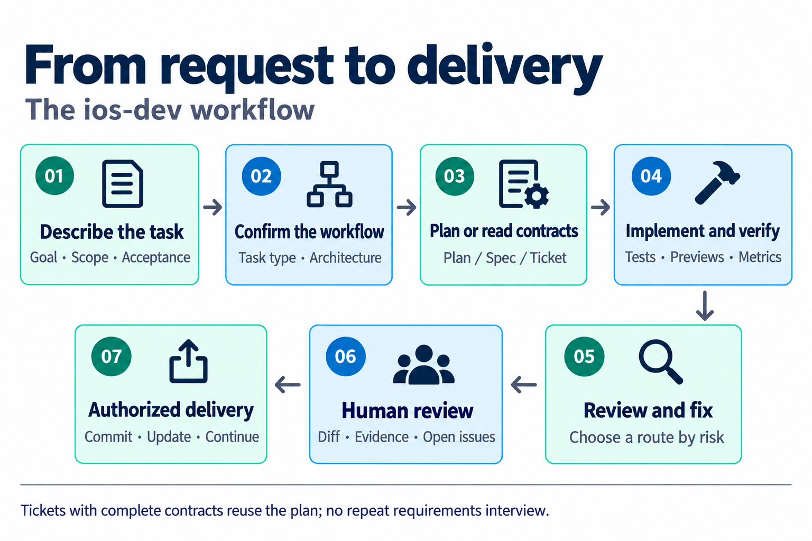
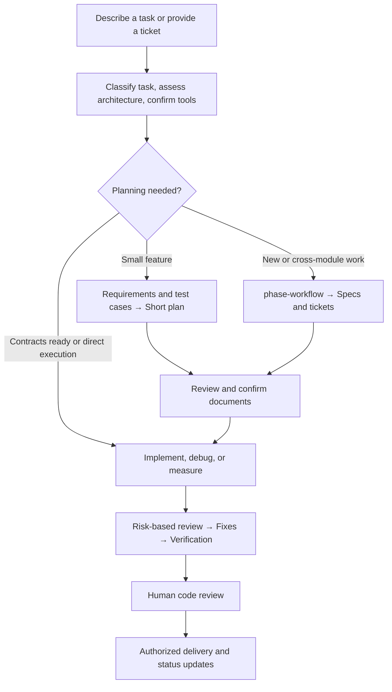
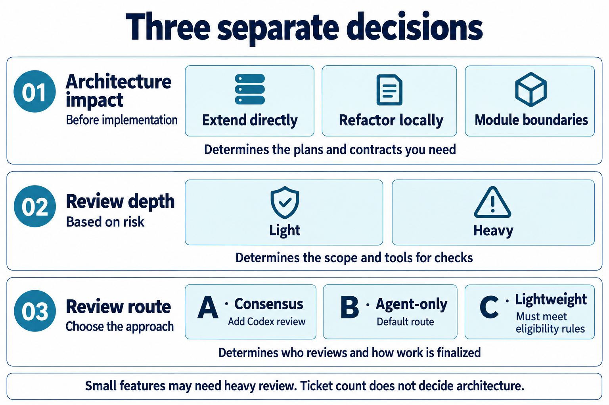
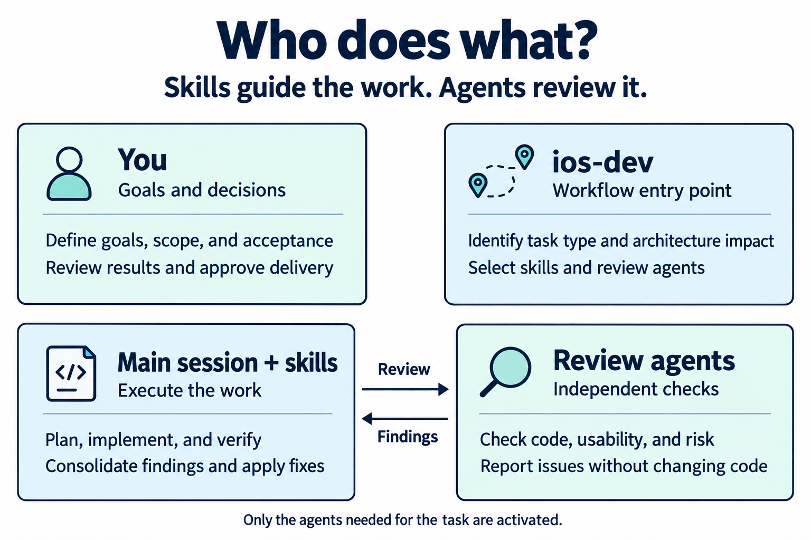

# ios-dev-skill

[繁體中文](README.md) | **English**

An iOS and SwiftUI development workflow for **Claude Code and Codex**, covering requirements, architecture, implementation, debugging, review, and delivery.

Describe your task in a sentence. `ios-dev` selects the relevant work instructions (skills) and review assistants (agents), presents the workflow, and proceeds after confirmation. This repository includes **12 skills and 9 review agents**. Third-party dependencies are installed separately.

| How you work | Where to start |
|---|---|
| I develop iOS apps and review code | Follow the setup below, then use `/ios-dev` or `$ios-dev` |
| I want to build an iPhone app without reading code | Read [VIBE.md](VIBE.md) (Traditional Chinese), then use `/ios-vibe` or `$ios-vibe` |
| I already have it installed | Jump to [everyday usage](#usage), [the workflow](#workflow), or [configuration](#configuration) |

> **Two entry points:** `ios-dev` involves the developer in architecture decisions and code review. `ios-vibe` records engineering decisions and uses hands-on trial cards for acceptance. Vibe mode currently supports apps with local, on-device data only; see its [scope limits](VIBE.md#目前做不到的事) (Traditional Chinese).

This is the English user guide. Skill instructions, reference documents, and the Vibe guide are primarily in Traditional Chinese. Command names and file paths are the same in both languages.

## Reading guide

For your first task, read **Quick start → Everyday usage → Development workflow**. Use the later sections as a reference for individual tools and settings.

- [Quick start: installation and your first task](#quick-start)
- [Everyday usage: requests, plans, and tickets](#usage)
- [Development workflow: planning, implementation, and review](#workflow)
- [Included tools: 12 skills and 9 agents](#toolkit)
- [Configuration and maintenance](#configuration)
- [Optional integrations](#extensions)
- [Troubleshooting](#faq)
- [Metrics and developer checks](#validation)
- [Repository structure and licensing](#project)

---

<a id="quick-start"></a>

## Quick start

### 1. Prepare your environment

| Tool | Purpose |
|---|---|
| Claude Code or Codex | Runs skills and agents; use either or both |
| Git | Downloads and updates this repository |
| Node.js / `npx` | Installs third-party skills |
| Python 3 | Used by installation, agent conversion, metrics, and tests; the conversion script supports Python 3.9 and later |
| macOS and Xcode | Builds, Previews, simulators, and device verification; open Xcode once to finish setup |

**Run `bash` examples in a terminal. Paste skill examples beginning with `/` or `$` into your AI conversation.**

### 2. Install the required dependencies

These four dependencies provide the main workflow's foundations:

| Dependency | Responsibility |
|---|---|
| `swift-architecture-skill` | Architecture selection, ownership boundaries, and state design |
| `swift-concurrency` | Async lifetimes, cancellation, and isolation |
| `swiftui-expert-skill` | SwiftUI implementation and review guidance, shared by the six quality-check agents |
| `superpowers` | Planning, implementation, TDD, and verification before completion |

Expand the instructions for your platform. If you use both platforms, install their dependencies separately.

<details>
<summary><strong>Claude Code installation</strong></summary>

Run in a terminal:

```bash
npx skills add https://github.com/efremidze/swift-architecture-skill \
  -a claude-code -g -y
npx skills add https://github.com/AvdLee/Swift-Concurrency-Agent-Skill \
  -a claude-code -g -y
npx skills@latest add https://github.com/AvdLee/SwiftUI-Agent-Skill \
  --skill swiftui-expert-skill \
  -a claude-code -g -y
```

Install Superpowers in your Claude Code conversation:

```text
/plugin install superpowers@claude-plugins-official
```

</details>

<details>
<summary><strong>Codex installation</strong></summary>

Run in a terminal. The plugin command matches this repository's installer and requires a Codex CLI version that supports it:

```bash
npx skills add https://github.com/efremidze/swift-architecture-skill \
  -a codex -g -y
npx skills add https://github.com/AvdLee/Swift-Concurrency-Agent-Skill \
  -a codex -g -y
npx skills@latest add https://github.com/AvdLee/SwiftUI-Agent-Skill \
  --skill swiftui-expert-skill \
  -a codex -g -y
codex plugin add superpowers@openai-curated
```

If your Codex version does not provide `plugin add`, use its supported plugin installation interface, then run the dependency check below.

</details>

### 3. Install this repository

Choose a directory where you will keep the tools:

```bash
git clone https://github.com/peter6601/ios-dev-skill.git
cd ios-dev-skill
./install.sh
./install.sh --check
```

Standard installation links this repository's skills, installs its agents, and reports dependency status. **It does not automatically install third-party dependencies.** Make sure all required items are marked `✓`. The installer labels dependencies `必裝` (required), `建議` (recommended), and `選配` (optional).

`--check` only checks dependencies. **Exit code 0 does not mean all dependencies are present.** Read the report.

The installer detects platforms from their directories or CLI executables. If both are present, it installs for both. To select one explicitly:

```bash
./install.sh --platform=claude
# Or:
./install.sh --platform=codex
```

> Installation uses symlinks, so keep this repository in place. Existing targets from another installation are skipped rather than overwritten; see [troubleshooting](#faq).

### 4. Start your first task

Open a new AI session in **your iOS app repository** and send:

**Claude Code**

```text
/ios-dev Add an export feature to the settings screen.
```

**Codex** — put the skill and request in the same message:

```text
$ios-dev Add an export feature to the settings screen.
```

The response first identifies the task type, architecture impact, selected tools, review route, and missing dependencies. Confirm the workflow to proceed. Planning tasks produce documents first; implementation follows once those documents are ready.

---

<a id="usage"></a>

## Everyday usage

### Describe the task

Start with `ios-dev`; you do not need to choose individual skills. Specific context helps narrow the investigation and changes.

| Task | Claude Code example |
|---|---|
| New project | `/ios-dev Plan an offline reading-list app. Start with adding items, search, and marking items as read.` |
| Small feature | `/ios-dev Add export to settings, using the existing data source.` |
| Presentation-only change | `/ios-dev Adjust home-screen card spacing and typography. Include before-and-after Previews.` |
| Bug fix | `/ios-dev Fix the screen freezing after login. Reproduction steps: ...` |
| Performance | `/ios-dev Improve home-screen scrolling performance. Measure the bottleneck first.` |
| Refactoring | `/ios-dev Refactor Features/Search while preserving existing search behavior.` |
| Existing ticket | `/ios-dev docs/features/search/tickets/<actual-filename>.md` |

For Codex, replace `/ios-dev` with `$ios-dev`. Replace example paths with files that exist in your project.

For a more detailed request, use this template:

```text
/ios-dev
Project: <repository path>
Goal: <what should be accomplished>
Current behavior: <existing behavior, problem, or reproduction steps>
Scope: <what to change and what to preserve>
Constraints: <minimum iOS version, existing architecture, compatibility>
Acceptance: <observable behavior, tests, or performance targets>
References: <spec, ticket, screenshots, or logs>
```

### Continue from a plan or ticket

#### Have a short plan? Confirm it and start implementation

After reviewing the plan, specify the document and scope:

```text
I have reviewed docs/plans/<actual-plan-filename>.md.
Implement the plan, then provide the diff and verification results for my review.
```

#### Need multiple tickets? Complete module planning first

For a new module, a multi-screen flow, or coordination across multiple async operations, `ios-dev` hands off to `phase-workflow` to create specifications and tickets. It prints the next command. A new session helps keep the context focused.

```text
/phase-workflow docs/features/search/search-design.md
```

#### Have a PM spec? Start from the existing requirements

Specify entry B:

```text
/phase-workflow Entry B: docs/specs/search-pm.md
```

#### Planning complete? Implement one ticket at a time

Use the generated ticket index to choose the next ticket:

```text
/ios-dev docs/features/search/tickets/<actual-filename>.md
```

These paths are examples. In Codex, use `$phase-workflow` and `$ios-dev`. Existing contracts are reused; planning is revisited only for missing information or work outside the agreed scope.

### End-to-end example: home-screen cards

This example changes only card spacing and typography. The actual tools and review depth depend on your project.

**Step 1 — State the goal and boundaries**

```text
/ios-dev Adjust the spacing and typography of home-screen cards.
Scope: Features/Home. Preserve data sources, tap behavior, and navigation.
Provide before-and-after screenshots under the same Preview conditions.
```

**Step 2 — Check that the proposed workflow matches your intent**

The AI describes the task classification, architecture impact, tools, and review route. Check:

- **Scope:** Is it limited to the requested screen? Are the behaviors you want preserved accounted for?
- **Acceptance:** Are screenshots comparable? Which devices, text sizes, or states need checking?
- **Environment:** Are Previews, simulators, or required skills unavailable? What is the alternative?

If the change requires ViewModel state or navigation changes, it is reclassified. Clarify the scope before proceeding through the corresponding workflow.

**Step 3 — Implement and check**

After confirmation, the AI edits the screen, reviews it, fixes findings, and verifies the result. If it discovers work outside the original scope, it should explain the impact before including it.

**Step 4 — Review the result and decide how to deliver**

Read the before-and-after comparison, diff, verification results, and open issues. Once the result meets your requirements, explicitly request a commit, PR, or the next task.

> **Give concrete feedback:** “Keep the heading size, but increase the card's vertical padding” is easier to act on than “Make it look better.”

<details>
<summary><strong>What should I bring to a new session?</strong></summary>

Provide enough information to locate the current state. You do not need to paste the entire conversation.

```text
$ios-dev docs/features/<feature>/tickets/<actual-filename>.md
Project: <repository path>
Progress: <what is complete>
Reviewed documents: <plan or specification paths>
Remaining work: <acceptance checks, errors, or decisions still open>
Read the existing contracts and records before continuing this ticket.
```

For a small feature without tickets, provide the short plan instead. Keep unfinished tests and findings visible so the next session knows what cannot yet be considered complete.

</details>

---

<a id="workflow"></a>

## Development workflow

### From request to delivery



*Figure 1 — The overall sequence. Planning depth and review approach vary by task.*

<details>
<summary><strong>Detailed flow: plan first or reuse an existing contract?</strong></summary>



</details>

This describes the developer-facing `ios-dev` workflow. For Vibe's product questions and trial cards, see [VIBE.md](VIBE.md#過程中會發生什麼) (Traditional Chinese).

### Seven task types

| Task type | Sequence | Main deliverables |
|---|---|---|
| New project / major feature | Clarify requirements → Architecture and test planning; an existing PM spec goes directly to `phase-workflow` | Design document, specifications, or tickets |
| Small feature | Clarify requirements and architecture impact → Short plan → Implementation | Plan, code, and verification results |
| Presentation-only change | Check state ownership → Implement → Polish | Updated UI and before-and-after Previews or screenshots |
| Bug fix | Gather symptoms → Find the root cause → Fix → Verify | Root-cause explanation, fix, and reproduction checks |
| Performance optimization | Establish a baseline → Change → Measure again the same way | Comparable measurements |
| Refactoring | Baseline → Ownership boundaries → Incremental changes → Compare | Behavior-preservation evidence and architecture comparison |
| Existing ticket | Read contracts → Ticket-level plan → Implement → Review → Update status | Code, verification, and ticket status |

**Planning produces documents; implementation changes code.** Module planning is triggered by ownership boundaries, not ticket count. UI work involving state, navigation, persistence, or async behavior is not presentation-only work.

### Before implementation: assess architecture impact

Identify who owns the current behavior, where the new requirement belongs, whether state is duplicated, and who owns async work. The conclusion is **extend directly**, **refactor locally**, or **define module boundaries**.

For new async work, document its lifetime, cancellation, reentrancy, stale-result handling, and related ownership guarantees.

### After implementation: review according to risk

Two separate choices govern review: **light/heavy determines review depth; A/B/C determines the review route**.



*Figure 2 — These decisions do not map one-to-one. “Extend directly” does not automatically mean lightweight review.*

| Route | When it applies | What happens |
|---|---|---|
| **B: Agent-only — default** | Normal development without additional Codex review | Specialists and task-specific auditors report findings; the main session fixes, polishes, and verifies |
| **A: Consensus** | You choose additional Codex review; complex bug fixes require it under the workflow rules | `consensus-review` receives specialist findings, Codex reviews, and Claude CLI applies fixes before re-review |
| **C: Lightweight** | One clear scope, production diff ≤50 lines, and all risk conditions satisfied | Two `ios-review` passes with fixes, followed by verification |

<details>
<summary><strong>Full eligibility rules for route C and when to escalate</strong></summary>

All of these conditions must hold:

- A single, clear scope with a production diff of at most 50 lines.
- No concurrency, state-machine, persistence, network-protocol, or migration changes.
- No public contract changes.
- Directly reproducible tests; presentation-only changes may use before-and-after Previews or screenshots.

Eligibility is checked again after implementation. If the actual changes exceed the limits or introduce these risks, review is escalated. The initial estimate is not sufficient.

</details>

### Human acceptance: review the changes and open issues

All three routes end with human code review. Check:

1. **What changed:** Does the diff match the agreed scope?
2. **How it was verified:** Do tests, Previews, or measurements support the completion claim?
3. **What remains:** Which findings were fixed, rejected, or deferred, and why?

Route A uses `approve-code`. Routes B and C use confirmation after the user reads the diff. Under this repository's workflow, commits, pushes, merges, and PR creation wait for approval. Delivery notes for B and C must state that no Codex cross-review was performed.

### Document review versus code review

`consensus-plan` is a read-only document review: it reports findings, while a person edits the document and decides when implementation can begin. `PASS` is not human approval. Without this integration, review documents manually.

If you have Codex but no Claude CLI, route A's repair stage is unavailable. Use B and state the limitation.

The [workflow router](skills/ios-dev/references/skill-router.md), [architecture impact check](skills/ios-dev/references/architecture-impact-check.md), and [handoff checklist](skills/ios-dev/references/handoff-checklist.md) contain the full rules (Traditional Chinese).

---

<a id="toolkit"></a>

## Included tools

**A skill is a set of work instructions. An agent is a focused review assistant.** Normally, start with `ios-dev` rather than invoking each tool yourself. The tools below ship with this repository; third-party additions appear under [optional integrations](#extensions).



*Figure 3 — The developer-facing division of work. Agents report findings; the main session consolidates fixes. Vibe interaction is documented separately in VIBE.md.*

### 12 skills

#### Entry points and planning

Decide what to build, how to divide the work, and where to start.

| Skill | Purpose |
|---|---|
| [ios-dev](skills/ios-dev/SKILL.md) | Classifies requests, selects tools, and coordinates the workflow |
| [ios-vibe](skills/ios-vibe/SKILL.md) | Uses plain-language product questions, records engineering decisions, and delivers trial cards |
| [office-hours](skills/office-hours/SKILL.md) | Clarifies product direction and the minimum viable version |
| [phase-workflow](skills/phase-workflow/SKILL.md) | Expands a design document or PM spec into specifications and tickets |

#### Debugging and code quality

Investigate problems, review implementations, and reduce unnecessary complexity.

| Skill | Purpose |
|---|---|
| [ios-investigate](skills/ios-investigate/SKILL.md) | Finds the root cause before fixing and verifying |
| [ios-review](skills/ios-review/SKILL.md) | Reviews code and fixes issues |
| [ios-distill](skills/ios-distill/SKILL.md) | Simplifies views, state, and navigation |

#### UI quality and operation safeguards

Improve the experience, edge cases, and protection around destructive operations.

| Skill | Purpose |
|---|---|
| [ios-polish](skills/ios-polish/SKILL.md) | Refines spacing, alignment, animation, and interaction details |
| [ios-critique](skills/ios-critique/SKILL.md) | Evaluates visual hierarchy, information architecture, and usability |
| [ios-harden](skills/ios-harden/SKILL.md) | Strengthens edge cases, error handling, localization, and accessibility |
| [localize-strings](skills/localize-strings/SKILL.md) | Moves hard-coded strings into a String Catalog |
| [careful-ios](skills/careful-ios/SKILL.md) | Checks destructive operations; platform behavior is described below |

### 9 review agents

#### Interface and user experience

Check code correctness and the experience people have using the app.

| Agent | Main focus |
|---|---|
| [swiftui-reviewer](agents/swiftui-reviewer.md) | SwiftUI correctness, state, and API usage |
| [ux-critique](agents/ux-critique.md) | Visual design, information architecture, interaction, and HIG |
| [resilience-auditor](agents/resilience-auditor.md) | Empty states, errors, long text, Dynamic Type, and VoiceOver |

#### Architecture, concurrency, and performance

Check ownership boundaries, async lifetimes, and runtime performance.

| Agent | Main focus |
|---|---|
| [architecture-auditor](agents/architecture-auditor.md) | View complexity, ownership boundaries, and architectural consistency |
| [concurrency-auditor](agents/concurrency-auditor.md) | Actor isolation, Task ownership, cancellation, and stale results |
| [perf-auditor](agents/perf-auditor.md) | View updates, identity, layout, and computational hotspots |

#### Specialized analysis when needed

Provide the relevant evidence when investigating traces, builds, or submission readiness.

| Agent | Main focus |
|---|---|
| [trace-analyzer](agents/trace-analyzer.md) | Hangs, hitches, and CPU hotspots in Instruments traces |
| [build-analyzer](agents/build-analyzer.md) | Xcode configuration, compilation hotspots, and SPM dependencies |
| [store-preflight-auditor](agents/store-preflight-auditor.md) | Plists, entitlements, privacy declarations, and store metadata |

<details>
<summary><strong>What should I give an agent?</strong></summary>

For a general code review, start with **files or a feature scope**. The following context makes the checks more useful.

| Agent | Useful input |
|---|---|
| [swiftui-reviewer](agents/swiftui-reviewer.md) | Files or feature scope; include the base branch for branch reviews |
| [ux-critique](agents/ux-critique.md) | Screens, the problem they solve, and intended users |
| [resilience-auditor](agents/resilience-auditor.md) | Feature or screen scope |
| [architecture-auditor](agents/architecture-auditor.md) | Scope; optionally architecture constraints, a PR checklist, or a baseline report |
| [concurrency-auditor](agents/concurrency-auditor.md) | Scope and async ownership contracts |
| [perf-auditor](agents/perf-auditor.md) | Scope; include the baseline report for optimization work |
| [trace-analyzer](agents/trace-analyzer.md) | `.trace` path and symptoms; optionally source code paths |
| [build-analyzer](agents/build-analyzer.md) | Project and scheme, or an existing build log |
| [store-preflight-auditor](agents/store-preflight-auditor.md) | Project root; optionally app category and store copy |

</details>

Agents report findings; the main session applies fixes. Here, “read-only” means they do not edit project source code. Build and trace tools may still create caches or analysis files. Only the agents relevant to the task and risk level are activated.

---

<a id="configuration"></a>

## Configuration and maintenance

### Installation locations and platform differences

| Item | Claude Code | Codex |
|---|---|---|
| Conversation entry | `/ios-dev request` | `$ios-dev` and the request in the same message |
| Skills | Symlinks in `~/.claude/skills` | Symlinks in `~/.agents/skills`; the installer checks `~/.codex/skills` for name conflicts |
| Agents | Markdown symlinks in `~/.claude/agents` | Generated `.toml` files in `~/.codex/agents` |
| Dependency paths | Agents reference `~/.claude/skills` | The converter resolves local skill and plugin paths |
| Confirmation | Platform-supported choice prompts | Available question tools, or numbered choices in text |
| `careful-ios` | Hook defined in the skill | Skill hooks are not used; Vibe installation adds a hook through `hooks.json` that you must trust via `/hooks` |

The installer supports custom `CLAUDE_HOME`, `CODEX_HOME`, and `AGENTS_HOME` locations. Claude agent sources still reference `~/.claude/skills`, so nonstandard locations require manual path adjustments. Codex resolves dependencies when generating agents.

<details>
<summary><strong>Installation command reference</strong></summary>

Run these from this repository's root:

| Command | Behavior |
|---|---|
| `./install.sh` | Detects platforms, installs this repository, and checks dependencies |
| `./install.sh --platform=claude` | Installs for Claude Code only; also accepts `codex` and `both` |
| `./install.sh --check` | Checks dependencies without changing files |
| `./install.sh --platform=codex --check` | Checks Codex dependencies only |
| `./install.sh --uninstall` | Removes this repository's links and generated agents |
| `./install.sh --vibe --dry-run` | Shows the Vibe installation plan without changing files |
| `./install.sh --vibe --yes` | Executes the Vibe installation plan |
| `./install.sh --vibe --check` | Also checks Vibe tools and configuration |
| `./install.sh --vibe --uninstall` | Also removes Vibe routing and the Codex hook |
| `./install.sh --help` | Displays usage information |

`--dry-run` requires `--vibe`. If automatic detection finds neither platform, the installer defaults to the Claude location. Use `--platform` when you need an explicit target.

</details>

<details>
<summary><strong>How does Vibe installation differ from standard installation?</strong></summary>

Standard installation handles this repository's tools and dependency checks. Vibe installation also attempts to install dependencies, configure simulator tools, and make `ios-vibe` the default entry point for iOS requests in global instructions:

- **Claude:** global `CLAUDE.md`; XcodeBuildMCP is added when Claude CLI is available.
- **Codex:** global `AGENTS.md`, the Build iOS Apps plugin, and the `careful-ios` hook in `~/.codex/hooks.json`.

Use `./install.sh --vibe --dry-run` first to see what your machine needs. Noninteractive execution requires `--yes`; an interactive terminal can also ask for confirmation.

After installation, on a Codex version that supports hooks, enter `/hooks` and trust `careful-ios`. This hook blocks matching commands; unlike the Claude hook, it cannot ask first.

**`--vibe` changes the global default entry point.** You do not need it for the standard developer workflow. See [VIBE.md](VIBE.md) for the beginner guide in Traditional Chinese.

</details>

<details>
<summary><strong>Where do planning documents go? Is Obsidian required?</strong></summary>

| Artifact | Default location inside your iOS repository |
|---|---|
| Design document for work within existing contracts | `docs/plans/YYYY-MM-DD-<feature>-design.md` |
| Design document, decision log, and architecture constraints for module planning | `docs/features/<feature>/` |
| Implementation plan | `docs/plans/YYYY-MM-DD-<feature>.md` |
| Module specifications and tickets | `docs/features/<feature>/` |
| Vibe engineering decisions | `docs/vibe-decisions.md` |

Medium-sized `phase-workflow` output includes an overview, context, ticket index and individual tickets, and AI prompts. Large output adds a roadmap, architecture documents, and coordination records. See the [output manifest](skills/phase-workflow/SKILL.md#output-manifest唯一真相模板不得連到不在自己這一欄的檔) (Traditional Chinese).

You may explicitly choose an external workspace for documents. **Obsidian is not required**; only the `board.base` board needs it. References to `second-brain` and `work-log-writer` concern the author's personal tools and can be skipped if unavailable.

</details>

### Update or uninstall

From this repository's root, check for local work you need to preserve, then update and reinstall:

```bash
git status --short
git pull --ff-only
./install.sh
./install.sh --check
```

Skills are symlinked and pick up updated content. **Codex agents are generated files**, so rerun installation to refresh them. Also rerun installation after adding or moving dependency skills, so agent paths are resolved again. Open a new AI session afterward.

To remove a standard installation, run `./install.sh --uninstall`. If you used Vibe installation, use `./install.sh --vibe --uninstall`. The latter also removes marked global routing and the Codex hook. **It does not automatically remove third-party skills, plugins, or XcodeBuildMCP.** Uninstall before moving or deleting this repository to avoid broken symlinks.

---

<a id="extensions"></a>

## Optional integrations

Required dependencies are listed in [Quick start](#quick-start). Add the tools below as needed. The workflow explains limitations or alternatives when recommended or optional tools are missing.

### Choose by need

| Area | Tools |
|---|---|
| SwiftUI implementation, UI patterns, and refactoring | xcode27-skills, Dimillian/Skills |
| Accessibility and edge cases | iOS-Accessibility-Agent-Skill |
| Requirements interviews and cross-review | mattpocock/skills, ai-review |
| Build speed and configuration | Xcode-Build-Optimization-Agent-Skill |
| Submission checks and publishing | app-store-preflight-skills, app-store-connect-cli-skills |
| A second SwiftUI review standard | twostraws' swiftui-agent-skill |

<details>
<summary><strong>Recommended: SwiftUI, refactoring, and performance</strong></summary>

#### xcode27-skills

[Source: superagents-lab/xcode27-skills](https://github.com/superagents-lab/xcode27-skills)

Provides `swiftui-specialist` and `swiftui-whats-new-27` for SwiftUI implementation guidance.

```bash
npx skills add superagents-lab/xcode27-skills \
  --skill swiftui-specialist \
  --skill swiftui-whats-new-27 \
  -a claude-code -g -y
```

#### Dimillian/Skills

[Source: Dimillian/Skills](https://github.com/Dimillian/Skills)

- **UI and refactoring:** `swiftui-ui-patterns`, `swiftui-view-refactor`.
- **Performance:** `swiftui-performance-audit`.
- **Review and batch work:** `review-swarm`, `bug-hunt-swarm`, `orchestrate-batch-refactor`.

```bash
npx skills add https://github.com/Dimillian/Skills \
  --skill swiftui-ui-patterns \
  --skill swiftui-view-refactor \
  --skill swiftui-performance-audit \
  --skill bug-hunt-swarm \
  --skill review-swarm \
  --skill orchestrate-batch-refactor \
  -a claude-code -g -y
```

For Codex, the first three UI and performance skills are also available through the Build iOS Apps plugin, which includes XcodeBuildMCP. This repository's installer uses:

```bash
codex plugin add build-ios-apps@openai-curated
```

Command support depends on your Codex version. For the other `npx` commands, replace `-a claude-code` with `-a codex`.

</details>

<details>
<summary><strong>Recommended: accessibility, requirements interviews, and cross-review</strong></summary>

#### Accessibility standards

[Source: dadederk/iOS-Accessibility-Agent-Skill](https://github.com/dadederk/iOS-Accessibility-Agent-Skill)

Provides `ios-accessibility`, used by `resilience-auditor` and `ios-harden`. Without it, they fall back to `swiftui-expert-skill` guidance.

```bash
npx skills add https://github.com/dadederk/iOS-Accessibility-Agent-Skill \
  --skill ios-accessibility \
  -a claude-code -g -y
```

#### Requirements interviews

[Source: mattpocock/skills](https://github.com/mattpocock/skills)

The `mattpocock-skills` plugin provides the requirements interview workflow. Without it, the workflow falls back to Superpowers. Install it in a Claude Code conversation:

```text
/plugin install mattpocock-skills@claude-plugins-official
```

Under the `ios-dev` workflow, run `setup-matt-pocock-skills` before the first use of these interview tools in a repository. The entry point checks the setup and lists a reminder when needed.

#### Document and code cross-review

[Source: peter6601/ai-review](https://github.com/peter6601/ai-review)

Provides:

- `consensus-plan`: read-only document findings for a person to address.
- `consensus-review`: route A, combining Codex review with Claude CLI repairs.

Follow that repository's `main` branch for installation and current parameters. Without it, documents can be reviewed manually and code can use route B.

</details>

<details>
<summary><strong>Optional: build analysis, submission checks, and publishing</strong></summary>

#### Build analysis and fixes

[Source: AvdLee/Xcode-Build-Optimization-Agent-Skill](https://github.com/AvdLee/Xcode-Build-Optimization-Agent-Skill)

Includes `xcode-project-analyzer`, `xcode-compilation-analyzer`, `spm-build-analysis`, and `xcode-build-fixer`. The first three support analysis; the fixer is needed only when applying build changes.

#### App Store submission checks

[Source: truongduy2611/app-store-preflight-skills](https://github.com/truongduy2611/app-store-preflight-skills)

Provides `app-store-preflight-skills`, the rules used by `store-preflight-auditor`.

#### App Store Connect operations

[Source: rorkai/app-store-connect-cli-skills](https://github.com/rorkai/app-store-connect-cli-skills)

Provides `asc-*` tools for App Store Connect publishing. These extend the developer workflow. Vibe mode retains its separate [scope limits](VIBE.md#目前做不到的事).

</details>

<details>
<summary><strong>Optional: a second SwiftUI review standard and framework-specific skills</strong></summary>

#### SwiftUI Pro

[Source: twostraws/swiftui-agent-skill](https://github.com/twostraws/swiftui-agent-skill)

`swiftui-reviewer` can use it as a second standard when the app's main target requires iOS 17 or later.

Keep it in `~/.claude/vendor`, **not the skills directory**, to avoid triggering it automatically in every project:

```bash
git clone https://github.com/twostraws/swiftui-agent-skill \
  ~/.claude/vendor/twostraws-swiftui-agent-skill
```

This is a Claude path. If the Codex conversion preview still reports Claude paths, confirm the dependency's accessible location before using this standard.

#### Project-specific framework skills

Choose from [dpearson2699/swift-ios-skills](https://github.com/dpearson2699/swift-ios-skills).

`-a claude-code` or `-a codex` selects the platform; `-g` means global installation. Omit `-g` to install a project-specific skill from your app repository.

</details>

---

<a id="faq"></a>

## Troubleshooting

Expand the situation that matches yours. Run installation commands from the **ios-dev-skill repository root**.

<details>
<summary><strong>ios-dev is missing after installation</strong></summary>

Open a new session, confirm the intended platform was selected, and look for skipped items in the installation output.

</details>

<details>
<summary><strong>The installer says an item was skipped</strong></summary>

A different version already occupies that target. Inspect and back it up first. If you want this repository's version, move the conflicting target aside and rerun installation.

</details>

<details>
<summary><strong>--check exits normally but prints ✗</strong></summary>

Read the required, recommended, and optional statuses in the output. Missing dependencies do not cause a nonzero exit code.

</details>

<details>
<summary><strong>A Codex agent cannot find a skill</strong></summary>

Install the dependency, then rerun `./install.sh --platform=codex`. The next section also provides a conversion preview command.

</details>

<details>
<summary><strong>Can I use this with Codex only?</strong></summary>

Yes, for planning and review routes B/C. Route A also requires Claude CLI and the `ai-review` dependencies.

</details>

<details>
<summary><strong>Why did I get a plan instead of code changes?</strong></summary>

New projects and small features begin with planning. Review the documents, then proceed to implementation or use the generated ticket handoff command.

</details>

<details>
<summary><strong>Why does a UI change require an architecture check?</strong></summary>

Spacing and styling alone are presentation changes. State, navigation, validation, and async changes also affect behavior and ownership boundaries.

</details>

<details>
<summary><strong>Why is an already planned ticket being planned again?</strong></summary>

Contracts that cover the current scope should be reused. Revisit only gaps or scope changes. A ticket-level implementation plan is still produced.

</details>

<details>
<summary><strong>Do I need Obsidian or a personal knowledge base?</strong></summary>

No. Documents default to your iOS repository, and personal note-taking tools can be skipped.

</details>

<details>
<summary><strong>Where do I change the workflow?</strong></summary>

Start with `skills/ios-dev/references/skill-router.md`. After changes, run the static checks and relevant tests below.

</details>

---

<a id="validation"></a>

## Metrics and developer checks

Run these from the **ios-dev-skill repository root**. You do not need to run them for every normal development task.

### SwiftUI structure metrics

```bash
python3 skills/ios-dev/scripts/swiftui-metrics.py /path/to/YourApp --top 15
```

Measures signals such as view body length, `@State`, and `isPresented` counts. Replace `/path/to/YourApp` with the actual source directory. These numbers guide inspection; interpret them against the feature's contracts.

### Preview Codex agent conversion

```bash
python3 scripts/gen-codex-agents.py --check
```

Lists planned output files, resolved dependency paths, and warnings without writing files. For nonstandard locations, repeat `--skills-root /path/to/skills` as needed. Once supplied, only those roots are searched.

<details>
<summary><strong>Local static checks and tests — no model calls</strong></summary>

```bash
python3 skills/ios-dev/scripts/validate-router.py --workspace . --skill-dir skills/ios-dev
python3 -m unittest discover -s skills/ios-dev/scripts -p "test_*.py"
python3 skills/ios-dev/evals/test_run_evals.py
python3 skills/careful-ios/bin/test_check_careful_ios.py
python3 -m unittest discover -s skills/ios-vibe/scripts -p "test_*.py"
python3 skills/ios-vibe/scripts/check-touchpoints.py
python3 scripts/test_gen_codex_agents.py
python3 test_install_sh.py
bash -n install.sh
./install.sh --check
```

</details>

<details>
<summary><strong>Workflow evaluations — execution calls a model</strong></summary>

After changing the router, use Claude evaluations to check task routing. Inspect the plan first; model calls require explicit execution flags:

```bash
python3 skills/ios-dev/evals/run_evals.py                  # Plan and stale-result status
python3 skills/ios-dev/evals/run_evals.py --probe-sandbox  # Model call: sandbox check
python3 skills/ios-dev/evals/run_evals.py --run            # Model calls: full evaluation
```

Evaluations use generated test projects and a sandbox. Results are excluded from version control. Model calls consume usage; cost and runtime depend on the model, cases, and execution.

</details>

---

<a id="project"></a>

## Repository structure and licensing

```text
ios-dev-skill/
├── README.md                  # Developer guide in Traditional Chinese
├── README.en.md               # Developer guide in English
├── VIBE.md                    # Non-coder guide in Traditional Chinese
├── install.sh                 # Installation, dependency checks, removal
├── skills/                    # 12 skills with references, scripts, templates
│   └── ios-dev/references/    # Routing, architecture checks, handoffs, plans
├── agents/                    # 9 review agent sources
├── scripts/                   # Codex agent conversion and tests
├── docs/
│   ├── design/                # Design documents for this toolset
│   └── images/                # README diagrams and generation prompts
├── test_install_sh.py         # Installer tests
├── NOTICE                     # Third-party sources and acknowledgments
├── LICENSE                    # Project license
└── LICENSES/                  # Third-party licenses
```

This project grew out of the author's day-to-day workflow. Company, project, and personal path details have been removed. The README is a user guide; each skill's `SKILL.md` and references define execution rules.

Diagrams were generated with the built-in `imagegen` tool. The text instructions remain authoritative. See the [image maintenance notes](docs/images/README.md) for purposes and prompts; [English localization prompts](docs/images/README.md#english-localization) are also recorded there.

### Acknowledgments and licensing

This project uses the MIT license. Some skills are adapted from [gstack](https://github.com/garrytan/gstack) and [Impeccable](https://github.com/pbakaus/impeccable), with their original licensing requirements preserved.

Workflow and evaluation design also draws on [agent-skills](https://github.com/addyosmani/agent-skills), [Spec Kit](https://github.com/github/spec-kit), [mattpocock/skills](https://github.com/mattpocock/skills), and [CCPM](https://github.com/automazeio/ccpm). See [`NOTICE`](NOTICE), [`LICENSE`](LICENSE), and [`LICENSES/`](LICENSES/) for details. Third-party dependencies are installed separately and are not bundled here.
