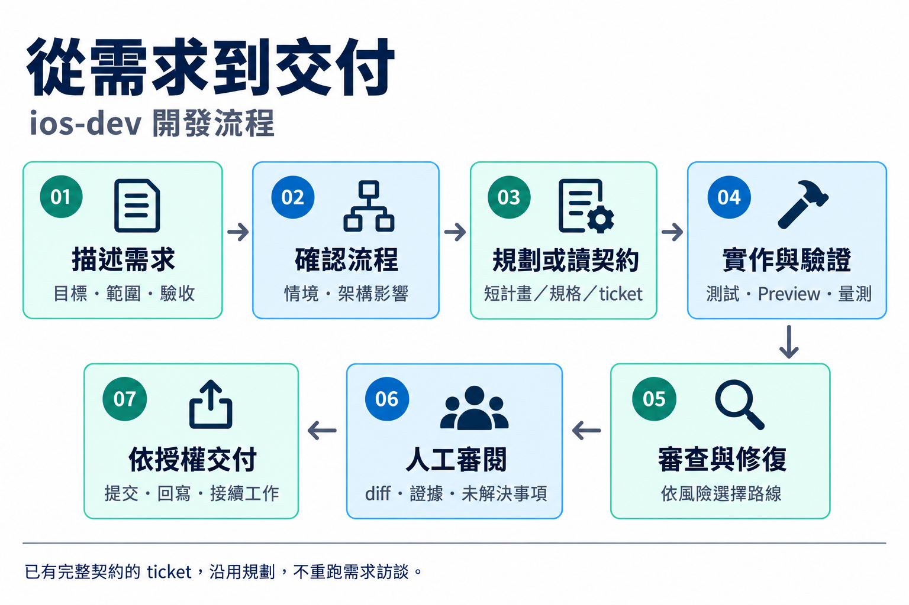
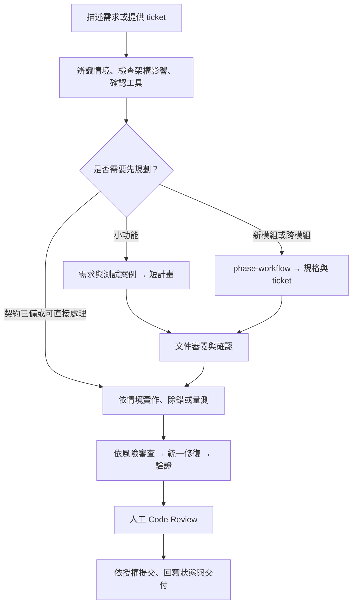
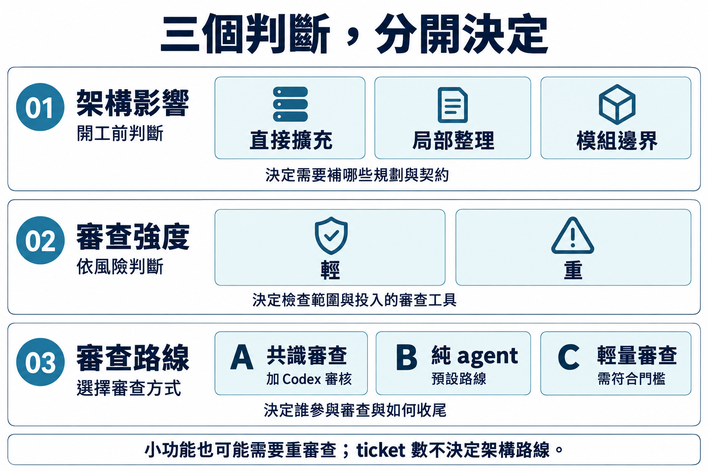
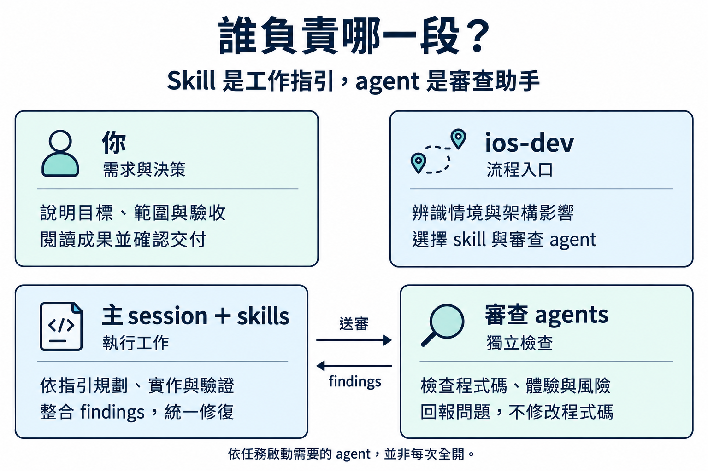

# ios-dev-skill

**繁體中文** | [English](README.en.md)

給 **Claude Code 與 Codex** 的 iOS／SwiftUI 開發工作流：從需求釐清、架構規劃，到實作、除錯、審查與交付。

用一句話描述需求，`ios-dev` 會依任務挑選工作指引（skill）與審查助手（agent），先列出流程，再依確認結果執行。本專案內含 **12 個 skill、9 個審查 agent**；第三方相依工具需另外安裝。

| 你的使用方式 | 建議入口 |
|---|---|
| 我是 iOS 工程師，會閱讀與審查程式碼 | 從下方安裝開始，使用 `/ios-dev` 或 `$ios-dev` |
| 我不讀程式碼，想用白話做出 iPhone app | 先讀 [VIBE.md](VIBE.md)，使用 `/ios-vibe` 或 `$ios-vibe` |
| 我已經安裝，想查操作或設定 | 前往[日常使用](#usage)、[流程說明](#workflow)或[設定與維護](#configuration) |

> **兩個入口的差別**：`ios-dev` 讓工程師參與架構決策與 Code Review；`ios-vibe` 由 AI 記錄工程決策，使用者以「試用卡」驗收。目前 vibe 模式僅支援資料留在單機的 app，完整範圍見 [VIBE.md](VIBE.md#目前做不到的事)。

## 閱讀導覽

第一次使用，依序讀「快速開始 → 日常使用 → 使用流程」即可。要查特定工具或設定時，再跳到後半部。

- [快速開始：安裝與第一個任務](#quick-start)
- [日常使用：怎麼描述需求與接續工作](#usage)
- [使用流程：規劃、實作與審查](#workflow)
- [內含工具：12 個 skill、9 個 agent](#toolkit)
- [設定與維護：平台差異、更新與移除](#configuration)
- [擴充套件](#extensions)
- [常見問題](#faq)
- [量測與開發者檢查](#validation)
- [專案結構與授權](#project)

---

<a id="quick-start"></a>

## 快速開始

### 1. 準備環境

| 工具 | 用途 |
|---|---|
| Claude Code 或 Codex | 執行 skill 與 agent，可擇一或同時使用 |
| Git | 下載與更新本專案 |
| Node.js／`npx` | 安裝第三方 skill |
| Python 3 | 安裝程式、Codex agent 轉換、量測與測試腳本；轉換腳本支援 Python 3.9 起 |
| macOS 與 Xcode | 建置、Preview、模擬器及裝置驗證；使用前先開啟 Xcode 完成初始設定 |

**下方 `bash` 指令在終端機執行；以 `/` 或 `$` 開頭的 skill 範例，貼到 AI 對話中。**

### 2. 安裝必要相依工具

這四項提供主要流程的基礎能力：

| 相依工具 | 負責什麼 |
|---|---|
| `swift-architecture-skill` | 架構選型、責任邊界與狀態設計 |
| `swift-concurrency` | 非同步工作的生命週期、取消與隔離 |
| `swiftui-expert-skill` | SwiftUI 實作與審查標準，六個品質閘門 agent 的共同依據 |
| `superpowers` | 計畫、實作、TDD 與完成前驗證 |

依使用的平台展開安裝指令；兩個平台都用，就各安裝一份。

<details>
<summary><strong>Claude Code 安裝指令</strong></summary>

在終端機執行：

```bash
npx skills add https://github.com/efremidze/swift-architecture-skill \
  -a claude-code -g -y
npx skills add https://github.com/AvdLee/Swift-Concurrency-Agent-Skill \
  -a claude-code -g -y
npx skills@latest add https://github.com/AvdLee/SwiftUI-Agent-Skill \
  --skill swiftui-expert-skill \
  -a claude-code -g -y
```

在 Claude Code 對話中安裝 Superpowers：

```text
/plugin install superpowers@claude-plugins-official
```

</details>

<details>
<summary><strong>Codex 安裝指令</strong></summary>

在終端機執行（plugin 指令與本專案安裝腳本一致，需使用支援該指令的 Codex CLI）：

```bash
npx skills add https://github.com/efremidze/swift-architecture-skill \
  -a codex -g -y
npx skills add https://github.com/AvdLee/Swift-Concurrency-Agent-Skill \
  -a codex -g -y
npx skills@latest add https://github.com/AvdLee/SwiftUI-Agent-Skill \
  --skill swiftui-expert-skill \
  -a codex -g -y
codex plugin add superpowers@openai-curated
```

若目前的 Codex 版本沒有 `plugin add`，請使用該版本提供的 plugin 安裝介面，裝好後再執行下方相依檢查。

</details>

### 3. 安裝本專案

在你打算長期保留工具的目錄中執行：

```bash
git clone https://github.com/peter6601/ios-dev-skill.git
cd ios-dev-skill
./install.sh
./install.sh --check
```

一般安裝會連結本專案的 skill、安裝 agent，並列出相依工具狀態；**不會自動安裝第三方相依工具**。請確認輸出中的「必裝」項目皆為 `✓`。`--check` 只檢查相依，結束碼為 0 不代表沒有缺件。

安裝程式依平台目錄或 CLI 自動偵測；若兩者都存在，兩邊都裝。只想裝其中一邊，可指定：

```bash
./install.sh --platform=claude
# 或
./install.sh --platform=codex
```

> 安裝採用符號連結，請保留本專案目錄。遇到同名的其他版本會顯示「跳過」，不會覆蓋；處理方式見[常見問題](#faq)。

### 4. 開始第一個任務

重新開啟 AI 工作階段，將工作目錄切到**你的 iOS app 專案**，在對話中輸入：

**Claude Code**

```text
/ios-dev 在設定頁新增匯出功能
```

**Codex**（skill 與需求寫在同一則訊息）

```text
$ios-dev 在設定頁新增匯出功能
```

你會先看到本次情境、架構影響、載入工具、審查方式與缺件提醒。確認流程後開始；規劃類任務會先產出文件，文件收斂後再接實作。

---

<a id="usage"></a>

## 日常使用

### 描述需求

不必先選 skill，從 `ios-dev` 開始即可。資訊愈具體，愈容易縮小調查與修改範圍。

| 想做的事 | Claude Code 對話範例 |
|---|---|
| 新專案 | `/ios-dev 規劃一個離線閱讀清單 App，先做新增、搜尋與已讀標記` |
| 小功能 | `/ios-dev 在設定頁新增匯出功能，沿用現有資料來源` |
| 純畫面 | `/ios-dev 調整首頁卡片的間距與字級，附上修改前後 Preview` |
| 修 bug | `/ios-dev 修正登入後畫面卡住的問題，重現步驟是……` |
| 效能優化 | `/ios-dev 改善首頁捲動效能，先量測目前瓶頸` |
| 重構 | `/ios-dev 重構 Features/Search，保留現有搜尋行為` |
| 接手 ticket | `/ios-dev docs/features/search/tickets/<實際檔名>.md` |

Codex 將以上 `/ios-dev` 改為 `$ios-dev`；範例中的路徑請換成專案內實際檔案。

需要更完整的描述時，可以貼這個範本：

```text
/ios-dev
專案：<repo 路徑>
目標：<這次希望做到什麼>
目前狀況：<既有行為、問題或重現步驟>
範圍：<要改／不改的部分>
限制：<最低 iOS 版本、既有架構、相容性要求>
驗收：<怎樣算完成；如操作結果、測試或效能數字>
參考：<spec、ticket、截圖或 log>
```

### 接續規劃與 ticket

#### 已有短計畫：確認後開始實作

如果已產出短計畫並完成審閱，可直接在對話中指定計畫與開工範圍：

```text
計畫 docs/plans/<實際計畫檔名>.md 已確認，請依計畫開始實作，完成後提供 diff 與驗證結果供我審閱。
```

#### 需要拆成多張 ticket：先完成模組規劃

需要新模組、多畫面流程或多個非同步工作協調時，`ios-dev` 會交給 `phase-workflow` 拆分規格與 ticket，並印出接續指令。建議在新工作階段執行，讓上下文保持聚焦。

```text
/phase-workflow docs/features/search/search-design.md
```

#### 已有 PM spec：從既有需求開始

已有 PM spec，也可以明確指定入口 B：

```text
/phase-workflow 入口 B：docs/specs/search-pm.md
```

#### 規劃完成：逐張接回實作

規劃完成後，依產生的 ticket 索引挑選下一張：

```text
/ios-dev docs/features/search/tickets/<實際檔名>.md
```

以上路徑是示意。Codex 使用 `$phase-workflow`、`$ios-dev`。接 ticket 時會沿用既有契約，只補缺漏或超出原範圍的規劃。

### 完整操作範例：調整首頁卡片

以下用「只改卡片間距與字級」示範一次往返。這是操作示例，實際工具與審查強度仍由專案狀況決定。

**第一步｜提供目標與邊界**

```text
/ios-dev 調整首頁卡片的間距與字級。
範圍是 Features/Home，不改資料來源、點擊行為與導航。
請提供相同 Preview 條件下的修改前後截圖。
```

**第二步｜閱讀本次流程，確認理解一致**

AI 會先說明任務分類、架構影響、準備使用的工具與審查路線。此時主要確認三件事：

- **範圍對不對**：是否只處理指定畫面，有沒有漏掉你要求保留的行為。
- **驗收清不清楚**：前後截圖是否能比較；有哪些裝置、字級或狀態需要檢查。
- **環境能不能做**：是否缺少 Preview、模擬器或所需 skill，替代方案是什麼。

如果 AI 發現需要改 ViewModel 狀態或導航，任務會重新分類；先釐清範圍，再接續對應流程。

**第三步｜實作與檢查**

確認流程後，AI 修改畫面，依判定執行審查、修復與驗證。若中途發現超出原範圍的問題，應說明原因與影響，不把新工作默默混進這次修改。

**第四步｜閱讀成果，再決定如何交付**

檢查修改前後的畫面、diff、驗證結果與未解決事項。確認符合需求後，再明確指示是否 commit、建立 PR 或接下一件事。

> **回饋可以很具體**：「標題字級保留，但卡片上下留白再增加」比「再好看一點」更容易精準修改。

<details>
<summary><strong>新工作階段要帶哪些資料？</strong></summary>

接續工作時，提供能定位目前進度的資料即可，不必重貼整段聊天紀錄。

```text
$ios-dev docs/features/<功能>/tickets/<實際檔名>.md
專案：<repo 路徑>
目前進度：<已完成到哪裡>
已確認的文件：<計畫或規格路徑>
待處理：<尚未完成的驗收、錯誤或決策>
請先讀既有契約與紀錄，再接續本張 ticket。
```

若是尚未拆成 ticket 的小功能，就改提供短計畫路徑。保留未完成的測試或 findings，能讓下一個工作階段知道哪些事情還不能宣稱完成。

</details>

---

<a id="workflow"></a>

## 使用流程

### 從需求到交付



*圖 1｜先看整體順序；規劃深度與審查方式會依任務調整。*

<details>
<summary><strong>展開細部流程：哪些任務先規劃，哪些沿用契約？</strong></summary>



</details>

這是工程師入口 `ios-dev` 的概覽。`ios-vibe` 的產品問答與試用卡流程另見 [VIBE.md](VIBE.md#過程中會發生什麼)。

### 七種任務如何處理

| 情境 | 工作順序 | 主要交付物 |
|---|---|---|
| 新專案／大功能 | 釐清需求 → 架構與測試規劃；已有 PM spec 則直接交 `phase-workflow` | Design Doc、規格或 tickets |
| 小功能 | 確認需求與架構影響 → 短計畫 → 實作 | 計畫、程式碼與驗證結果 |
| 純畫面調整 | 檢查狀態來源 → 實作 → 打磨 | 畫面與前後 Preview／截圖 |
| 修 bug | 收集症狀 → 找根因 → 修正 → 驗證 | 根因說明、修正與重現驗證 |
| 效能優化 | 建立基線 → 修改 → 用同一方式再量測 | 修改前後的量測證據 |
| 重構 | 現況基線 → 責任邊界 → 分段修改 → 對比 | 行為不變的驗證與架構對比 |
| 接手 ticket | 讀既有契約 → 本張計畫 → 實作 → 審查 → 回寫 | 程式碼、驗證與 ticket 狀態 |

**規劃階段只產文件，實作階段才改程式。** 是否需要模組規劃由責任邊界決定，不由 ticket 數量決定；牽涉狀態、導航、持久化或非同步工作的畫面改動，也不算純畫面調整。

### 開工前：先確認架構影響

開發前先確認「現有行為誰負責、新需求接到哪裡、有沒有重複狀態、非同步工作誰管理」，得出 **直接擴充／局部整理／模組邊界** 的結論。有新非同步工作時，補上生命週期、取消、重入與舊結果失效等契約。

### 完成後：依風險選擇審查

審查另分兩個維度：**輕／重決定檢查強度；A／B／C 決定審查路線**。



*圖 2｜三個判斷各有用途，沒有一對一對應；「直接擴充」不代表一定走輕量審查。*

| 路線 | 何時使用 | 操作與結果 |
|---|---|---|
| **B：純 agent（預設）** | 一般開發，未選額外 Codex 審核 | specialist 與情境 auditor 回報問題，主 session 統一修復、打磨與驗證 |
| **A：共識審查** | 選擇「加 Codex 審核」；複雜 bugfix 依規則強制使用 | `consensus-review` 接收 specialist 結果，由 Codex 審查、Claude CLI 修復，再審查 |
| **C：輕量審查** | 範圍單一、production diff ≤50 行，且風險條件全部符合 | `ios-review` 兩輪檢查與修正，再驗證 |

<details>
<summary><strong>C 路線的完整條件，以及何時需要升級</strong></summary>

C 路線必須同時符合：

- 範圍單一且清楚，production diff 不超過 50 行。
- 不碰 concurrency、state machine、持久化、網路協定或 migration。
- 不改公開契約。
- 能提供直接可重現的測試；純呈現畫面可用前後 Preview／截圖。

完成後會重新判定。若實際改動超過範圍或涉及上述風險，便升級審查；不能只按開工時的估計決定。

</details>

### 人工驗收：確認改動與未解決事項

三條路線最後都需要人工 Code Review。閱讀成果時，重點是：

1. **改了什麼**：diff 是否符合原本同意的範圍。
2. **如何驗證**：測試、Preview 或量測結果是否支持完成的宣稱。
3. **還有什麼問題**：findings 哪些已修、哪些駁回或延後，以及理由。

A 路線使用 `approve-code`；B、C 由使用者閱讀 diff 後確認。依本專案流程，核准前不 commit、push、merge 或建立 PR；B、C 的交付說明須標明未經 Codex 交叉驗證。

### 文件審查與程式碼審查的差別

文件審查 `consensus-plan` 與程式碼審查不同：它只回報文件 findings，由人修改與決定何時開工；`PASS` 不等於人工核准。未安裝時改由人審閱文件。只有 Codex、沒有 Claude CLI 時，A 路線的修復階段不可用，改用 B 並說明限制。

完整判定以[流程對照表](skills/ios-dev/references/skill-router.md)、[架構影響檢查](skills/ios-dev/references/architecture-impact-check.md)與[交棒收尾清單](skills/ios-dev/references/handoff-checklist.md)為準。

---

<a id="toolkit"></a>

## 內含工具

**Skill 是工作指引；agent 是執行特定審查的助手。** 平常從 `ios-dev` 進入即可，無需逐一呼叫。下列工具隨本專案安裝，第三方套件則列在[擴充套件](#extensions)。



*圖 3｜工程師入口的分工概覽。Agent 回報問題，由主 session 整合修復；vibe 的使用者互動另見 VIBE.md。*

### 12 個 skill

#### 入口與規劃

決定要做什麼、怎麼拆，以及從哪裡開始。

| Skill | 用途 |
|---|---|
| [ios-dev](skills/ios-dev/SKILL.md) | 辨識需求、選擇工具、安排完整工作流 |
| [ios-vibe](skills/ios-vibe/SKILL.md) | 白話產品問答、記錄工程決策、以試用卡驗收 |
| [office-hours](skills/office-hours/SKILL.md) | 釐清產品方向與最小可行版本 |
| [phase-workflow](skills/phase-workflow/SKILL.md) | 將 Design Doc 或 PM spec 展開成規格與 ticket |

#### 除錯與程式碼品質

處理既有問題、檢查實作，並減少不必要的複雜度。

| Skill | 用途 |
|---|---|
| [ios-investigate](skills/ios-investigate/SKILL.md) | 先找根因，再修正與驗證 |
| [ios-review](skills/ios-review/SKILL.md) | 審查程式碼並修正問題 |
| [ios-distill](skills/ios-distill/SKILL.md) | 簡化 View、狀態與導航結構 |

#### 畫面品質與操作保護

在功能可用之後，補齊體驗、邊界狀態與操作保護。

| Skill | 用途 |
|---|---|
| [ios-polish](skills/ios-polish/SKILL.md) | 調整間距、對齊、動畫與互動細節 |
| [ios-critique](skills/ios-critique/SKILL.md) | 評估視覺層級、資訊架構與使用體驗 |
| [ios-harden](skills/ios-harden/SKILL.md) | 補強邊界狀態、錯誤處理、多語系與無障礙 |
| [localize-strings](skills/localize-strings/SKILL.md) | 將寫死的字串整理到 String Catalog |
| [careful-ios](skills/careful-ios/SKILL.md) | 檢查破壞性操作；平台差異見下方設定 |

### 9 個審查 agent

#### 介面與使用體驗

檢查程式碼是否正確，以及使用者實際操作是否順暢。

| Agent | 主要檢查 |
|---|---|
| [swiftui-reviewer](agents/swiftui-reviewer.md) | SwiftUI correctness、state 與 API 使用 |
| [ux-critique](agents/ux-critique.md) | 視覺、資訊架構、互動與 HIG |
| [resilience-auditor](agents/resilience-auditor.md) | 空值、錯誤、長文字、Dynamic Type、VoiceOver |

#### 架構、並行與效能

檢查責任邊界、非同步生命週期與執行效能。

| Agent | 主要檢查 |
|---|---|
| [architecture-auditor](agents/architecture-auditor.md) | View 複雜度、責任邊界與 pattern 一致性 |
| [concurrency-auditor](agents/concurrency-auditor.md) | actor isolation、Task ownership、取消與舊結果 |
| [perf-auditor](agents/perf-auditor.md) | 重繪、identity、layout 與運算熱點 |

#### 需要時啟動的專項分析

有 trace、build 問題或送審需求時，再提供對應資料進行分析。

| Agent | 主要檢查 |
|---|---|
| [trace-analyzer](agents/trace-analyzer.md) | Instruments trace 的 hang、hitch 與 CPU 熱點 |
| [build-analyzer](agents/build-analyzer.md) | Xcode 設定、編譯熱點與 SPM 依賴 |
| [store-preflight-auditor](agents/store-preflight-auditor.md) | 送審前的 plist、entitlements、隱私與 metadata |

<details>
<summary><strong>要交給 agent 哪些資料？</strong></summary>

一般程式碼審查提供**檔案或功能範圍**即可開始；以下補充資料能讓審查更貼近這次需求。

| Agent | 建議提供 |
|---|---|
| [swiftui-reviewer](agents/swiftui-reviewer.md) | 檔案／功能範圍；審 branch 時附 base branch |
| [ux-critique](agents/ux-critique.md) | 畫面範圍、解決的問題與目標使用者 |
| [resilience-auditor](agents/resilience-auditor.md) | 功能或畫面範圍 |
| [architecture-auditor](agents/architecture-auditor.md) | 範圍；可附架構約束、PR checklist、基線報告 |
| [concurrency-auditor](agents/concurrency-auditor.md) | 範圍與非同步契約 |
| [perf-auditor](agents/perf-auditor.md) | 範圍；優化時附改前報告 |
| [trace-analyzer](agents/trace-analyzer.md) | `.trace` 路徑、症狀；可附原始碼路徑 |
| [build-analyzer](agents/build-analyzer.md) | 專案與 scheme，或現有 build log |
| [store-preflight-auditor](agents/store-preflight-auditor.md) | 專案根目錄；可附 app 類型與商店文案 |

</details>

Agent 負責回報問題，程式碼由主 session 統一修復。這裡的「唯讀」指不修改專案程式碼；build／trace 工具仍可能產生快取或分析檔。不是每次都啟動全部九個 agent，名單依情境與風險選擇。

---

<a id="configuration"></a>

## 設定與維護

### 安裝位置與平台差異

| 項目 | Claude Code | Codex |
|---|---|---|
| 對話入口 | `/ios-dev 需求` | `$ios-dev` 與需求放同一則訊息 |
| Skill 位置 | `~/.claude/skills`，符號連結 | `~/.agents/skills`，符號連結；安裝時檢查 `~/.codex/skills` 同名衝突 |
| Agent 位置 | `~/.claude/agents`，連結 Markdown | `~/.codex/agents`，由腳本產生 `.toml` |
| 工具路徑 | agent 參照 `~/.claude/skills` | 轉換腳本解析本機 skill／plugin 路徑 |
| 確認方式 | 平台的選項式提問 | 有可用提問工具時使用；否則列編號選項 |
| `careful-ios` | skill 內的 hook | 不採用 skill 內 hook；vibe 安裝另寫入 `hooks.json`，需信任 |

安裝程式支援 `CLAUDE_HOME`、`CODEX_HOME`、`AGENTS_HOME` 自訂路徑。不過 Claude agent 原稿仍引用 `~/.claude/skills`，改位置後須自行調整；Codex 會在產生 agent 時解析依賴路徑。

<details>
<summary><strong>安裝指令速查</strong></summary>

以下均在本專案根目錄執行：

| 指令 | 行為 |
|---|---|
| `./install.sh` | 自動偵測平台，安裝本專案並檢查相依 |
| `./install.sh --platform=claude` | 只安裝 Claude Code；亦接受 `codex`、`both` |
| `./install.sh --check` | 只檢查相依，不修改檔案 |
| `./install.sh --platform=codex --check` | 只檢查 Codex 相依 |
| `./install.sh --uninstall` | 移除本專案連結及產生的 agent |
| `./install.sh --vibe --dry-run` | 列出 vibe 安裝計畫，不修改檔案 |
| `./install.sh --vibe --yes` | 執行 vibe 安裝計畫 |
| `./install.sh --vibe --check` | 加查 vibe 所需工具與設定 |
| `./install.sh --vibe --uninstall` | 另外清除 vibe 寫入的路由與 Codex hook |
| `./install.sh --help` | 顯示完整用法 |

`--dry-run` 僅支援搭配 `--vibe`。自動偵測若兩個平台都找不到，腳本會使用 Claude 安裝位置；需要確定目標時請加 `--platform`。

</details>

<details>
<summary><strong>一般安裝與 vibe 安裝有何不同？</strong></summary>

一般安裝只處理本專案工具與相依檢查。vibe 安裝還會嘗試補裝相依 skill／plugin、設定模擬器工具，並在全域設定加入「iOS 需求預設走 ios-vibe」的路由：

- Claude：全域 `CLAUDE.md`；可用 Claude CLI 時加入 XcodeBuildMCP。
- Codex：全域 `AGENTS.md`、Build iOS Apps plugin，以及 `~/.codex/hooks.json` 的 `careful-ios` hook。

先用 `./install.sh --vibe --dry-run` 查看這台電腦實際需要做的事。非互動環境須加 `--yes` 才執行；互動終端機也可以依提示確認。Codex 安裝後需在支援 hooks 的版本中輸入 `/hooks`，信任 `careful-ios`。此 hook 會擋下命中的指令，無法像 Claude 一樣先詢問。

**`--vibe` 會改變全域預設入口**，不只是多裝一個 skill；一般工程師流程不需要為了使用 `ios-dev` 加上此旗標。完整新手教學見 [VIBE.md](VIBE.md)。

</details>

<details>
<summary><strong>規劃文件放哪裡？需要 Obsidian 嗎？</strong></summary>

| 產物 | 預設位置（相對於你的 iOS 專案） |
|---|---|
| Design Doc（沿既有契約擴充） | `docs/plans/YYYY-MM-DD-<feature>-design.md` |
| Design Doc、Decision Log 與架構約束（模組規劃） | `docs/features/<功能>/` |
| 實作計畫 | `docs/plans/YYYY-MM-DD-<feature>.md` |
| 模組規格與 ticket | `docs/features/<功能>/` |
| Vibe 工程決策 | `docs/vibe-decisions.md` |

`phase-workflow` 的中型規劃包含 overview、context、ticket 索引與逐張檔案、ai-prompts；大型再加入 roadmap、architecture 與 coordination。完整清單見 [phase-workflow](skills/phase-workflow/SKILL.md#output-manifest唯一真相模板不得連到不在自己這一欄的檔)。

可以明確指定外部 workspace 存放規劃文件。**不必使用 Obsidian**，只有 `board.base` 看板需要它。流程提到的 `second-brain`、`work-log-writer` 是作者的個人工具，未安裝可跳過。

</details>

### 更新與移除

在本專案根目錄確認沒有需要保留的未提交改動後，更新並重新安裝：

```bash
git status --short
git pull --ff-only
./install.sh
./install.sh --check
```

Skill 使用連結，更新後會讀到新內容；**Codex agent 是產生的檔案**，需要重跑安裝才能同步。補裝或移動相依 skill 後，也應重跑安裝以刷新 agent 內的路徑。完成後重新開啟 AI 工作階段。

要移除一般安裝，執行 `./install.sh --uninstall`；曾使用 vibe 安裝則執行 `./install.sh --vibe --uninstall`。後者另外移除標記的全域路由與 Codex hook，**不會自動移除第三方 skill、plugin 或 XcodeBuildMCP**。先解除安裝，再刪除或搬移本專案，避免留下失效連結。

---

<a id="extensions"></a>

## 擴充套件

必裝套件見[快速開始](#quick-start)。以下工具按需要加裝；缺少建議或選配工具時，流程會提示限制或替代方式。

### 依需求選擇

| 你想補強的部分 | 對應工具 |
|---|---|
| SwiftUI 實作、畫面 pattern 與重構 | xcode27-skills、Dimillian/Skills |
| 無障礙與邊界狀態 | iOS-Accessibility-Agent-Skill |
| 需求訪談與交叉審查 | mattpocock/skills、ai-review |
| 編譯速度與建置問題 | Xcode-Build-Optimization-Agent-Skill |
| 上架前檢查與發佈 | app-store-preflight-skills、app-store-connect-cli-skills |
| SwiftUI 的第二套審查標準 | twostraws 的 swiftui-agent-skill |

<details>
<summary><strong>建議套件：SwiftUI、重構與效能</strong></summary>

#### xcode27-skills

[來源：superagents-lab/xcode27-skills](https://github.com/superagents-lab/xcode27-skills)

提供 `swiftui-specialist` 與 `swiftui-whats-new-27`，作為 SwiftUI 實作指引。

```bash
npx skills add superagents-lab/xcode27-skills \
  --skill swiftui-specialist \
  --skill swiftui-whats-new-27 \
  -a claude-code -g -y
```

#### Dimillian/Skills

[來源：Dimillian/Skills](https://github.com/Dimillian/Skills)

- **畫面與重構**：`swiftui-ui-patterns`、`swiftui-view-refactor`。
- **效能分析**：`swiftui-performance-audit`。
- **審查與批次工作**：`review-swarm`、`bug-hunt-swarm`、`orchestrate-batch-refactor`。

```bash
npx skills add https://github.com/Dimillian/Skills \
  --skill swiftui-ui-patterns \
  --skill swiftui-view-refactor \
  --skill swiftui-performance-audit \
  --skill bug-hunt-swarm \
  --skill review-swarm \
  --skill orchestrate-batch-refactor \
  -a claude-code -g -y
```

Codex 的前三個畫面與效能 skill 也可由 Build iOS Apps plugin 提供，並附 XcodeBuildMCP。本專案安裝腳本使用：

```bash
codex plugin add build-ios-apps@openai-curated
```

是否支援此指令，以使用中的 Codex 版本為準；其他 `npx` 指令可將 `-a claude-code` 改為 `-a codex`。

</details>

<details>
<summary><strong>建議套件：無障礙、需求訪談與交叉審查</strong></summary>

#### 無障礙標準

[來源：dadederk/iOS-Accessibility-Agent-Skill](https://github.com/dadederk/iOS-Accessibility-Agent-Skill)

提供 `ios-accessibility`，由 `resilience-auditor` 與 `ios-harden` 使用。未安裝時，流程改用 `swiftui-expert-skill` 的審查依據。

```bash
npx skills add https://github.com/dadederk/iOS-Accessibility-Agent-Skill \
  --skill ios-accessibility \
  -a claude-code -g -y
```

#### 需求訪談

[來源：mattpocock/skills](https://github.com/mattpocock/skills)

提供 `mattpocock-skills` plugin 的需求訪談流程；未安裝時改用 Superpowers。在 Claude Code 對話中安裝：

```text
/plugin install mattpocock-skills@claude-plugins-official
```

依 `ios-dev` 流程，repo 首次使用相關訪談工具前需執行 `setup-matt-pocock-skills`；入口會檢查前置設定並列出提醒。

#### 文件與程式碼交叉審查

[來源：peter6601/ai-review](https://github.com/peter6601/ai-review)

提供 `consensus-plan` 與 `consensus-review`：

- `consensus-plan`：唯讀文件審查，提出 findings，由人改文件。
- `consensus-review`：Code Review 路線 A，包含 Codex 審查與 Claude CLI 修復。

安裝方式與參數以該專案 `main` 分支的說明為準。未安裝時，文件由人審閱，程式碼可走 B 路線。

</details>

<details>
<summary><strong>選配套件：建置分析、送審與發佈</strong></summary>

#### 建置分析與修正

[來源：AvdLee/Xcode-Build-Optimization-Agent-Skill](https://github.com/AvdLee/Xcode-Build-Optimization-Agent-Skill)

包含 `xcode-project-analyzer`、`xcode-compilation-analyzer`、`spm-build-analysis`、`xcode-build-fixer`。前三者供建置分析使用，實際修正才需要 fixer。

#### App Store 送審前檢查

[來源：truongduy2611/app-store-preflight-skills](https://github.com/truongduy2611/app-store-preflight-skills)

提供 `app-store-preflight-skills`，作為 `store-preflight-auditor` 的規則庫。

#### App Store Connect 操作

[來源：rorkai/app-store-connect-cli-skills](https://github.com/rorkai/app-store-connect-cli-skills)

提供 `asc-*` 工具，支援 App Store Connect 發佈流程。這些屬於工程師工作流的擴充；vibe 模式的範圍仍以 [VIBE.md](VIBE.md#目前做不到的事)為準。

</details>

<details>
<summary><strong>選配套件：第二套 SwiftUI 審查標準與專案 framework</strong></summary>

#### SwiftUI Pro

[來源：twostraws/swiftui-agent-skill](https://github.com/twostraws/swiftui-agent-skill)

`swiftui-reviewer` 可將它作為第二套標準，僅在 app 主 target ≥ iOS 17 時使用。

請放在 `~/.claude/vendor`，**不要放進 skills 目錄**，避免在每個專案自動觸發：

```bash
git clone https://github.com/twostraws/swiftui-agent-skill \
  ~/.claude/vendor/twostraws-swiftui-agent-skill
```

這是 Claude 路徑；Codex agent 的轉換預檢若仍回報 Claude 路徑，需先確認實際可讀的位置，再使用這套標準。

#### 專案專用 framework skill

可從 [dpearson2699/swift-ios-skills](https://github.com/dpearson2699/swift-ios-skills) 挑選。

安裝參數中，`-a claude-code`／`-a codex` 指定平台，`-g` 表示全域安裝。省略 `-g`，可在目標 app repo 安裝專案專用 skill。

</details>

---

<a id="faq"></a>

## 常見問題

先從目前遇到的狀況展開查看。涉及安裝的指令，請在 **ios-dev-skill 根目錄**執行。

<details>
<summary><strong>安裝後找不到 ios-dev</strong></summary>

重新開啟工作階段；確認裝到正確平台，並查看安裝輸出是否有「跳過」。

</details>

<details>
<summary><strong>安裝顯示「跳過」</strong></summary>

目標已有其他版本。先確認並備份舊內容；若確定要換成本專案版本，移走衝突目標後重跑安裝。

</details>

<details>
<summary><strong>--check 正常結束，但有 ✗</strong></summary>

檢查依據是輸出中的「必裝／建議／選配」狀態；腳本不以非零結束碼表示缺件。

</details>

<details>
<summary><strong>Codex agent 顯示找不到 skill</strong></summary>

先補裝依賴，再重跑 `./install.sh --platform=codex`；下方有轉換預檢指令。

</details>

<details>
<summary><strong>只有 Codex，能使用嗎？</strong></summary>

可以走一般規劃與 B／C 審查；A 路線還需要 Claude CLI 與 `ai-review` 相依工具。

</details>

<details>
<summary><strong>為什麼只產出計畫，沒有改 code？</strong></summary>

新專案與小功能先走規劃；確認文件後接實作，或依輸出的指令接 ticket。

</details>

<details>
<summary><strong>改 UI 為什麼需要架構檢查？</strong></summary>

只改間距、樣式屬純呈現；涉及 state、導航、驗證或 async，就需要行為與責任邊界檢查。

</details>

<details>
<summary><strong>為什麼已規劃的 ticket 又被要求規劃？</strong></summary>

應沿用已涵蓋本次範圍的契約，只補缺漏或範圍變更；本張 ticket 的實作計畫仍會產出。

</details>

<details>
<summary><strong>沒有 Obsidian 或第二大腦能用嗎？</strong></summary>

可以。文件預設留在 iOS repo，個人筆記工具可跳過。

</details>

<details>
<summary><strong>想調整流程，從哪裡改？</strong></summary>

先讀 `skills/ios-dev/references/skill-router.md`；修改後執行下方靜態檢查與相關測試。

</details>

---

<a id="validation"></a>

## 量測與開發者檢查

以下指令在 **ios-dev-skill 根目錄**執行，不需要為一般使用每次重跑。

### SwiftUI 結構量測

```bash
python3 skills/ios-dev/scripts/swiftui-metrics.py /path/to/YourApp --top 15
```

統計 View 的 body 行數、`@State`、`isPresented` 等訊號，供架構檢查參考。請將 `/path/to/YourApp` 換成實際原始碼目錄；數字是檢查線索，仍需對照功能契約判讀。

### Codex agent 轉換預檢

```bash
python3 scripts/gen-codex-agents.py --check
```

只列出預計產生的檔案、依賴解析位置與警告，不寫入檔案。非標準位置可重複指定 `--skills-root /path/to/skills`；指定後只搜尋提供的根目錄。

<details>
<summary><strong>本機靜態檢查與測試（不呼叫模型）</strong></summary>

```bash
python3 skills/ios-dev/scripts/validate-router.py --workspace . --skill-dir skills/ios-dev
python3 -m unittest discover -s skills/ios-dev/scripts -p "test_*.py"
python3 skills/ios-dev/evals/test_run_evals.py
python3 skills/careful-ios/bin/test_check_careful_ios.py
python3 -m unittest discover -s skills/ios-vibe/scripts -p "test_*.py"
python3 skills/ios-vibe/scripts/check-touchpoints.py
python3 scripts/test_gen_codex_agents.py
python3 test_install_sh.py
bash -n install.sh
./install.sh --check
```

</details>

<details>
<summary><strong>流程評測（實際執行會呼叫模型）</strong></summary>

修改流程對照表後，可用 Claude 評測情境分流。先查看計畫；只有明確加上執行參數才呼叫模型：

```bash
python3 skills/ios-dev/evals/run_evals.py                  # 列出計畫與結果是否過期
python3 skills/ios-dev/evals/run_evals.py --probe-sandbox  # 呼叫模型檢查沙箱
python3 skills/ios-dev/evals/run_evals.py --run            # 呼叫模型執行完整評測
```

評測使用產生的測試專案與沙箱，結果不納入版控。模型呼叫會使用額度，成本與時間依模型、情境及當次執行而異。

</details>

---

<a id="project"></a>

## 專案結構與授權

```text
ios-dev-skill/
├── README.md                  # 繁體中文工程師使用指南
├── README.en.md               # 英文工程師使用指南
├── VIBE.md                    # 不讀程式碼的使用者指南
├── install.sh                 # 安裝、相依檢查與移除
├── skills/                    # 12 個 skill 及 references／scripts／templates
│   └── ios-dev/references/    # 路由、架構檢查、交棒清單與計畫格式
├── agents/                    # 9 個審查 agent 原稿
├── scripts/                   # Codex agent 轉換與測試
├── docs/
│   ├── design/                # 工具組本身的設計文件
│   └── images/                # README 圖解與生成提示紀錄
├── test_install_sh.py         # 安裝程式測試
├── NOTICE                     # 第三方來源與聲明
├── LICENSE                    # 本專案授權
└── LICENSES/                  # 第三方授權
```

本專案整理自作者的日常工作流，已移除公司、專案與個人路徑資訊。README 提供操作導覽；執行規則以各 skill 的 `SKILL.md` 與 references 為準。

圖解使用內建 `imagegen` 生成，文字規則仍以本地 skill 為準。圖片用途與生成提示見 [圖解維護說明](docs/images/README.md)。

### 致謝與授權

本專案採 MIT 授權。部分 skill 改寫自 [gstack](https://github.com/garrytan/gstack) 與 [Impeccable](https://github.com/pbakaus/impeccable)，並保留原作授權要求。

流程與評測設計另參考 [agent-skills](https://github.com/addyosmani/agent-skills)、[Spec Kit](https://github.com/github/spec-kit)、[mattpocock/skills](https://github.com/mattpocock/skills) 與 [CCPM](https://github.com/automazeio/ccpm)。完整聲明見 [`NOTICE`](NOTICE)、[`LICENSE`](LICENSE) 與 [`LICENSES/`](LICENSES/)。第三方相依套件需另行安裝，本專案未包含其內容。
