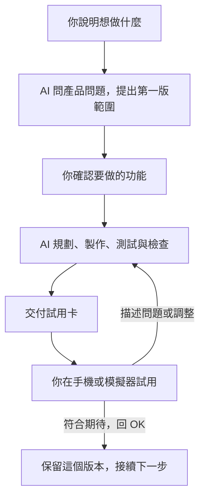

# 不寫 code，也能做出自己的 iPhone app

**iOS Vibe 使用指南** · [回到工具總覽](README.md) · [English developer guide](README.en.md)

你用白話說想做什麼，AI 負責規劃、寫程式、測試與檢查。做出可以試用的功能後，它會給你一張「試用卡」，請你在 iPhone 或電腦上的模擬器操作幾個步驟，再決定是否接受這次改動。

**你負責想法、選擇與試用；AI 負責工程工作，並留下紀錄。** 不需要先學會寫程式，也不需要自己挑選開發工具。

> 適合先做一個自己使用、資料留在單機的小工具，例如離線閱讀清單、桌遊收藏或手動輸入的旅行打包清單。目前不支援登入、付款、跨裝置同步、敏感個資或上架發佈。

## 閱讀導覽

第一次使用，先讀「準備 → 安裝 → 開始」。後面的試用、回復版本與排錯，可以用到時再看。

- [你需要準備什麼](#prepare)
- [安裝：把這段話貼給 AI](#install)
- [開始：描述你的第一個 app](#start)
- [過程中會發生什麼](#journey)
- [試用卡：怎麼確認做對了](#trial-card)
- [日常操作：加功能、改畫面與回報問題](#everyday)
- [第一次裝到 iPhone](#iphone)
- [改壞了怎麼辦：回復版本與資料](#versions)
- [目前做不到的事](#limits)
- [常見問題](#faq)
- [更新、解除安裝與交接](#maintenance)

---

<a id="prepare"></a>

## 你需要準備什麼

| 你需要 | 用來做什麼 |
|---|---|
| **一台 Mac** | 製作、測試與安裝 iPhone app |
| **Xcode** | 從 Mac App Store 安裝，開啟一次並完成初始設定 |
| **可操作本機專案的 Claude 或 Codex 環境** | 例如 Claude Code、Codex 桌面 app 或 Codex CLI；不只是一般文字聊天 |
| **可使用該 AI 工具的帳號** | 讓 AI 執行開發工作；使用量依你的服務方案計算 |
| **iPhone 與 Apple 帳號（選用）** | 想裝到自己的手機時需要；也可以先只用 Mac 上的模擬器 |

**模擬器**是在 Mac 上執行的虛擬 iPhone。沒有實機，也能先看畫面、點按按鈕、測試基本操作；相機、震動或實際手感等仍可能需要真實手機確認。

Git、Node.js／`npx`、Python 等安裝工具可以請 AI 檢查與協助補齊，不必自己先研究每個名稱。

> **「app 不連網」與「AI 不連網」是兩件事。** Vibe 的限制是做出來的 app 不依賴連網功能；安裝工具與使用 AI 服務仍可能需要網路及帳號。

---

<a id="install"></a>

## 安裝：把這段話貼給 AI

### 1. 請 AI 檢查環境並列出安裝計畫

把下面整段貼到你準備使用的 Claude 或 Codex 開發環境：

```text
請幫我安裝 iOS vibe 開發工具：

1. 先檢查這台 Mac 的 Xcode、Git、Node.js／npx、Python 與 AI 開發環境是否可用。
   缺少什麼就用白話說明，帶我補齊。
2. 把 https://github.com/peter6601/ios-dev-skill 下載到 ~/Developer/ios-dev-skill。
   如果已存在，先確認是不是同一個專案、有沒有尚未保存的修改，再處理更新。
3. 在該資料夾執行 ./install.sh --vibe --dry-run。
   告訴我會安裝哪些工具、修改哪些設定，以及會影響 Claude、Codex 還是兩者。
4. 等我確認後，再執行 ./install.sh --vibe --yes。
5. 完成後執行 ./install.sh --vibe --check，逐項說明是否可用。
   如果有失敗、缺件或跳過的項目，帶我處理，不要只說「安裝完成」。
```

`~/Developer/ios-dev-skill` 是範例位置。如果你已把工具放在別處，請替換成實際路徑；後續更新與解除安裝也使用同一個位置。

### 2. 確認後安裝

AI 應先告訴你預計做哪些事，你確認後才執行。Vibe 安裝主要會：

- 安裝本專案的工作指引與審查助手，並嘗試補齊相依工具。
- 設定可用的模擬器工具，協助看畫面與操作。
- 在全域指引加入「iOS 需求預設使用 vibe 模式」的設定。
- 使用 Codex 時，加入 `careful-ios` 的操作保護設定。

**如果這台 Mac 同時有 Claude 和 Codex，安裝程式可能兩邊都設定。** 只想裝其中一邊，可以先告訴 AI：「只幫我設定 Codex」或「只幫我設定 Claude」。

### 3. 重新開啟，再完成平台設定

**Claude：**重新開啟工作階段，接著用 `/ios-vibe` 開始。

**Codex：**重新開啟後，在支援 hooks 的版本輸入 `/hooks`，把 `careful-ios` 設為信任，再用 `$ios-vibe` 開始。它會擋下檢查規則命中的破壞性指令。

若找不到 `/hooks` 或 `careful-ios`，請把看到的狀況告訴 AI，先確認版本與安裝狀態，不要把它當成已經啟用。

<details>
<summary><strong>怎麼知道真的裝好了？</strong></summary>

請 AI 解釋 `./install.sh --vibe --check` 的結果，至少確認：

- Xcode 與 Python 可以執行。
- 必要的 skill 與 plugin 沒有缺件。
- 所用平台可以辨識 `ios-vibe`。
- 模擬器操作工具若不可用，有說明替代方式。
- Codex 的操作保護設定已加入，且需要的信任步驟已完成。

安裝輸出中的「跳過」通常表示目標位置已有其他版本，不一定是錯誤；仍需確認你實際用到的是哪一份。**檢查指令正常結束，也不代表所有項目都通過。**

</details>

<details>
<summary><strong>工具資料夾可以刪掉嗎？</strong></summary>

請保留 `ios-dev-skill` 資料夾。安裝使用連結，移動或刪除它可能讓 AI 找不到工作指引。

工具資料夾與你之後建立的 app 專案是兩份不同的內容。開始做 app 時，請 AI 告訴你 app 專案實際存在哪裡；之後接續開發要開啟的是那個 app 專案。

</details>

---

<a id="start"></a>

## 開始：描述你的第一個 app

先選一件你想解決的小事。第一版先做核心操作，之後再逐步加功能。

### Claude

```text
/ios-vibe 我想做一個離線閱讀清單 app。
可以手動加入書名、標記已讀，關掉再打開時清單還在。
先只給我自己使用，不需要登入或同步。
請告訴我 app 專案會存在哪個資料夾。
```

### Codex

```text
$ios-vibe 我想做一個離線閱讀清單 app。
可以手動加入書名、標記已讀，關掉再打開時清單還在。
先只給我自己使用，不需要登入或同步。
請告訴我 app 專案會存在哪個資料夾。
```

如果還沒有完整想法，至少說清楚：**給誰用、最常做的一件事、希望看到的結果**。畫面可以用文字描述，也可以提供參考截圖。

<details>
<summary><strong>想描述得更完整，可以用這個範本</strong></summary>

```text
/ios-vibe
我想做：<一句話說明>
給誰用：<例如只有我自己>
最重要的操作：<例如新增與勾選項目>
第一個畫面：<希望一打開看到什麼>
資料要不要保留：<關掉 app 再打開後，哪些內容應該還在>
第一版先不做：<暫時不需要的功能>
參考：<喜歡的畫面或操作方式>
```

Codex 把第一行改成 `$ios-vibe`。不知道怎麼回答的欄位可以直接寫「請給我建議」，不用為了開始而把所有細節都想完。

</details>

---

<a id="journey"></a>

## 過程中會發生什麼



### 你會參與的部分

**產品選擇。** AI 會問 app 給誰用、第一個畫面長什麼樣、資料要不要保留，以及刪除前要不要確認等問題。問題應該用你能理解的語言，並提供建議。

**實際試用。** AI 做完可操作的功能後，你確認「這是不是我要的」，以及手機上實際操作的感受。

### AI 會處理的部分

規劃、技術選擇、寫程式、自動測試、審查與修正，由 AI 依工作流執行。技術決策會記在專案裡，方便之後查閱或交給工程師。

新 app 會先確認一個**最多三個畫面**的初版範圍，再拆成幾步完成。AI 會告訴你總共幾步、其中幾步可以試用；有些步驟只整理內部結構，不會單獨交一張你無法操作的卡。

你不必自己拆工作清單或手動指定下一張 ticket。對試用卡回覆後，AI 會依已確認的範圍接續處理。

> **試用卡代表這次驗證已通過，不代表程式永遠不會出錯。** 每張卡都應說明實際做過哪些檢查，以及需要你留意的地方。

---

<a id="trial-card"></a>

## 試用卡：怎麼確認做對了

試用卡把一次改動整理成你可以照做的步驟，最多五步。涉及保存資料時，會包含「完全關掉 app 再打開」的確認。

以下是**格式示例**，不代表你現在已有這個 app，也不代表已經替你完成檢查：

> ### 試用卡：閱讀清單可以新增一本書了
>
> **做了什麼**
>
> 可以輸入書名，加入自己的閱讀清單。
>
> **改前 → 改後**
>
> 原本只有空白清單 → 現在可以新增並看到書名。實際交付時會附可取得的截圖；無法取得時會明確註記。
>
> **請你在 iPhone 上試（約 2 分鐘）**
>
> 1. 打開 app，點「新增」。
> 2. 輸入「想讀的一本書」，點「儲存」。
> 3. 確認清單出現剛才的書名。
> 4. 完全關掉 app 再打開，確認書名仍在。
>
> **最可能出問題的地方**
>
> 沒填書名就按儲存時，應看到說明，不應多出空白項目。
>
> **這份改動的檢查狀況**
>
> 沒有人類讀過這份程式碼。實際交付時，這裡會列出已完成的測試、AI 審查，以及是否有另一個模型交叉檢查。
>
> 試完請回「OK」。哪裡不對，直接描述你看到的。

### 「OK」代表什麼？

對這張卡回「OK」，表示你接受**這次卡片描述的成果**。AI 會把它整理進目前採用的版本，再接續已確認的工作。

它不代表你授權上傳 GitHub、公開發佈、付款或處理範圍外的新需求。尚未試用時，可以直接說「我還沒試，先等一下」。

### 不符合期待時怎麼回？

描述**你做了什麼、實際看到什麼、原本希望怎樣**即可：

```text
我輸入書名後按儲存，清單沒有增加，也沒有錯誤訊息。
我希望儲存成功後回到清單，看到剛才的書名。
```

不知道問題名稱沒有關係，截圖或操作錄影也能幫助 AI 理解。

<details>
<summary><strong>交付試用卡前，AI 應該檢查什麼？</strong></summary>

AI 需要先確認 app 能成功建置、自動測試通過、主要操作已測試、沒有超出 vibe 範圍的程式行為，並完成規定的 AI 審查。

依這次功能，還會確認例如：關掉重開後資料仍在、刪除只影響指定項目、拒絕權限不閃退、連續操作不會產生重複或損壞的資料。

如果檢查沒過，就應說明仍在處理的問題，不應把未完成的工作包裝成可接受的試用卡。你做得到的試用，不能代替 AI 本來就能執行的自動檢查。

</details>

<details>
<summary><strong>可以讓另一個 AI 再檢查一次嗎？</strong></summary>

預設由目前使用的 AI 派審查助手檢查。如果你**主要使用 Claude，也安裝並登入了 Codex**，可以選擇再加一次 Codex 唯讀審查。

它會增加一些時間與使用量。AI 會記住審查設定；遇到資料保存、刪除、新權限或背景工作等較高風險改動時，也可能再詢問是否只對這次加強檢查。

主要使用 Codex 時，不把另開一個 Codex 審查當成「另一家模型交叉檢查」。不論選哪種方式，試用卡都應如實說明誰檢查過，不能暗示已有人類工程師審過程式碼。

</details>

---

<a id="everyday"></a>

## 日常操作：加功能、改畫面與回報問題

接續時，先在 AI 開發環境開啟**原本的 app 專案資料夾**。以下範例使用 Claude；Codex 把 `/ios-vibe` 改為 `$ios-vibe`。

### 加一個功能

```text
/ios-vibe 閱讀清單想加「已讀」標記。
我希望可以切換「全部」和「還沒讀」，原本的書名都要保留。
```

### 調整畫面

```text
/ios-vibe 清單的字有點小，請放大書名，讓每列更容易點。
保留目前的新增與已讀操作方式。
```

### 回報問題

```text
/ios-vibe 我把書名改掉後，關掉再打開，卻又變回原本的名稱。
每次都會發生。我是在自己的 iPhone 上試的。
```

### 暫停後接著做

```text
/ios-vibe 繼續這個 app。
上次做到閱讀清單可以新增書名，最後一張試用卡我已經回 OK。
請先看專案裡的紀錄，告訴我下一步原本要做什麼。
```

如果不記得做到哪裡，也可以直接說「請先幫我確認進度」。不要為了接續而另外建立一個同名 app。

---

<a id="iphone"></a>

## 第一次裝到 iPhone

沒有 iPhone 可以跳過這節，先在模擬器試用。要裝到手機時，AI 會準備 app，並一次帶你完成一個步驟。

| 你需要親自做 | AI 會協助什麼 |
|---|---|
| 在 Xcode 登入自己的 Apple 帳號 | 告訴你在哪裡登入、確認設定是否完成 |
| 接上 iPhone，依裝置提示信任電腦、開啟開發者模式 | 確認 Mac 找得到手機，協助排除連線問題 |
| 若手機要求，信任這個開發者 | 告訴你在哪裡完成，再確認 app 可以開啟 |

**Apple 帳號密碼、驗證碼、手機密碼都由你自己輸入。** 不需要貼到 AI 對話裡。

之後安裝新版通常不必重做全部初始設定；AI 會依目前手機與 Xcode 的狀態處理。

### 免費 Apple 帳號的使用限制

可以使用免費帳號進行個人實機測試。Apple 的 Personal Team 安裝描述檔會在核發後 **7 天到期**，到期後可能需要重新建置與安裝，並非 app 永久安裝完成。其他裝置與識別碼限制，以 [Apple 官方說明](https://developer.apple.com/support/compare-memberships/)為準。

幾天後打不開時，可以說：

```text
/ios-vibe 之前裝到 iPhone 的 app 現在打不開。
請先確認是不是安裝期限到期，協助重新安裝，並保留原本資料。
```

先請 AI 判斷原因，不要自行刪除 app；刪除可能連同手機裡的資料一起移除。

---

<a id="versions"></a>

## 改壞了怎麼辦

### 想回到之前可以用的樣子

直接說：

```text
/ios-vibe 回到上一版。請先告訴我會回到哪個版本，資料會不會受影響。
```

AI 會用白話列出近期的存檔點，例如「已經可以新增書名」「加入已讀標記」，讓你選擇。只說「上一版」時，流程預設指上一個存檔點；不確定是哪個，就先請它列出。

回復時會保留原本的工作歷史，再從選定版本接著處理。

### App 版本與手機資料，是兩件事

回復程式，不一定能直接還原手機裡的資料。若途中改過資料格式，舊版可能需要使用升級前留下的資料備份。

這表示升級後新增或修改的內容，可能不會出現在回復後的 app 中。AI 必須先說明影響、保存目前資料，並等你確認；不能直接把它當成一般畫面回復。

### 存檔與備份，也不一樣

| 名稱 | 代表什麼 |
|---|---|
| App 的存檔點 | 保留某個程式版本，方便回到之前的實作 |
| 資料升級備份 | 在支援的資料格式升級前，保留 app 資料副本 |
| 遠端程式備份 | 另外把專案版本上傳到指定位置，例如 GitHub |

**本機存檔不等於雲端備份；上傳程式也不等於備份手機資料。** 沒有另外設定遠端時，程式版本仍只存在這台 Mac。

若你需要專案備份，可以請 AI 說明選項與要上傳的內容，再決定是否上傳。這不會讓 app 自動具備雲端同步功能。

---

<a id="limits"></a>

## 目前做不到的事

目前 vibe 模式的範圍是：**資料留在單機、不依賴連網功能、可以由使用者實際試用的小型 app**。

### 適合從這些開始

- 手動新增書名、標記已讀的離線閱讀清單。
- 手動輸入物品、逐項勾選的打包清單。
- 記錄桌遊名稱與分類的本機收藏清單。

以上都不包含線上搜尋、共享帳號或跨裝置同步。

### 以下需要其他開發安排

| 需求 | 例子 |
|---|---|
| 帳號與登入 | Apple／Google 登入、會員系統 |
| 付款與訂閱 | 付費解鎖、月費方案 |
| 連網與跨裝置資料 | 呼叫外部服務、跟家人共用、雲端備份、自動同步 |
| 敏感個資 | 健康、財務、精確位置、聯絡人，或上傳相簿內容 |
| 破壞性的資料格式修改 | 既有欄位改名、刪除、改型別，或拆分／合併資料種類；可先評估新增欄位的替代方式 |
| 對外發佈 | App Store 上架、TestFlight 測試 |

遇到這些需求，AI 會說明限制，再提供適合的下一步：先縮成符合範圍的版本，或整理目前成果交給工程師。

**單機版本仍須避開敏感個資等限制。** 把財務或健康資料留在手機，並不會自動讓它符合目前範圍。

---

<a id="faq"></a>

## 常見問題

<details>
<summary><strong>我完全不懂程式，可以直接開始嗎？</strong></summary>

可以。先準備 Mac、Xcode 與能操作本機專案的 AI 開發環境，再貼上安裝範本。

你仍需要決定想做什麼、試用成果，以及親自完成帳號登入與手機設定。AI 不應要求你先理解程式架構才能回答問題。

</details>

<details>
<summary><strong>AI 找不到 ios-vibe，或安裝一直有錯誤</strong></summary>

先重新開啟工作階段，確認用的是 `/ios-vibe`（Claude）或 `$ios-vibe`（Codex）。還是不行時，把安裝輸出中的錯誤或「跳過」訊息貼給 AI，請它檢查實際安裝位置與相依工具。

不要反覆刪除資料夾重裝。先確認是哪個環節失敗，通常比較容易保留既有設定並修正問題。

</details>

<details>
<summary><strong>為什麼 AI 做了很久，還沒有給我試用卡？</strong></summary>

有些步驟在準備內部結構，還沒有能試的畫面；也可能是測試或審查尚未通過。

可以問：「目前做到哪裡？卡在哪一步？下一個能讓我試的是什麼？」AI 應清楚說明進度與阻礙，不用未通過檢查的成果充當完成品。

</details>

<details>
<summary><strong>可以直接跳過檢查，先給我試嗎？</strong></summary>

Vibe 模式要求先完成規定的驗證再出卡。想更快看到成果，可以縮小這次功能，例如先做新增書名，搜尋與分類留到下一次。

</details>

<details>
<summary><strong>我原本就有一個 app，也能用嗎？</strong></summary>

可以先請 AI 檢查，但既有 app 不一定符合 vibe 的資料、連網與開發規則。AI 應先說明限制，由你確認後才處理；超出範圍的部分仍需要工程師接手。

</details>

<details>
<summary><strong>AI 做的 app 可以直接給很多人用嗎？</strong></summary>

試用卡不代表已有人類工程師讀過程式碼，也不是上架審核或正式營運保證。目前 vibe 模式不處理 App Store 或 TestFlight 發佈。

如果要對外提供服務，請先整理專案並交由工程師審閱，確認後續開發與發佈安排。

</details>

<details>
<summary><strong>需要付費 Apple 開發者帳號嗎？</strong></summary>

只在模擬器試用，不需要為此加入付費 Apple Developer Program。個人實機測試可使用免費 Apple 帳號，但有安裝期限與其他限制，見[第一次裝到 iPhone](#iphone)。AI 工具本身的服務費用與使用額度則另計。

</details>

---

<a id="maintenance"></a>

## 更新、解除安裝與交接

### 更新工具

將路徑換成你的實際安裝位置，再貼給 AI：

```text
請幫我更新 ~/Developer/ios-dev-skill 的 vibe 開發工具。
先檢查有沒有我自己的未保存修改，不要覆蓋或丟棄它們。
說明需要更新的項目，再執行安裝與 ./install.sh --vibe --check，告訴我是否需要重新開啟 AI。
```

這是在更新開發工具，不代表已替你的 app 增加功能。若更新涉及新的安裝或設定變更，先看清楚 AI 的說明再確認。

### 解除安裝

```text
請在 ~/Developer/ios-dev-skill 執行 ./install.sh --vibe --uninstall。
告訴我移除了哪些工具連結與全域設定，以及還保留哪些相依工具。
不要刪除我做的 app 專案或手機資料。
```

解除安裝會移除本專案的連結、產生的 agent，以及 vibe 寫入的全域路由與 Codex hook。其他可能共用的 skill、plugin 與模擬器工具不會自動移除。

### 交給工程師接手

```text
請幫我整理這個 app，準備交給工程師接手。
用一頁說明目前有哪些功能、已知問題、做過哪些檢查，以及我接下來想做什麼。
請整理成 HANDOFF.md，並告訴我專案資料夾的位置。
```

<details>
<summary><strong>工程師可能需要哪些文件？</strong></summary>

- `HANDOFF.md`：交接摘要。
- `docs/vibe-decisions.md`：AI 做過的工程決策與審查設定。
- 功能規劃與工作進度：通常在 `docs/features/`。
- 專案原始碼、測試，以及仍未解決的問題。

若想切換成由工程師參與技術決策與 Code Review 的流程，請參考 [README.md](README.md)。

</details>
